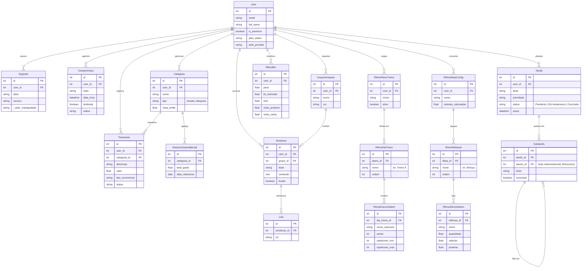

<div align="center">

  

  <br>
  <br>

  
  
  

  <br>
  
  
  
  
  
  <br>

  
  

</div>

---

O **Bússola V2** atua como um sistema operacional pessoal, dividido em **núcleos funcionais integrados**:

* **🔭 Panorama:** Central de comando com visão unificada de `KPIs`, métricas vitais e resumos do dia.
* **💪 Ritmo:** Gestão completa de performance física, incluindo fichas de treino, dieta e `bio-tracking`.
* **💰 Finanças:** Controle financeiro com registro de transações, categorização e análise de **fluxo de caixa**.
* **🧠 Registros:** Um "segundo cérebro" para gestão de conhecimento, anotações e tarefas.
* **📅 Agenda:** Organização temporal que centraliza compromissos.
* **🔐 Cofre:** Vault seguro e isolado para armazenamento de dados sensíveis e senhas.

# Índice

- [Índice](#índice)
  - [🗺️ Roadmap](#️-roadmap)
    - [✅ Concluído (Fase 1: Fundação)](#-concluído-fase-1-fundação)
    - [🚧 Em Desenvolvimento (Fase 2: Inteligência \& Infra)](#-em-desenvolvimento-fase-2-inteligência--infra)
    - [🔭 Futuro (Fase 3: Expansão)](#-futuro-fase-3-expansão)
- [🛠️ Tecnologias Usadas](#️-tecnologias-usadas)
  - [🎨 Frontend (SPA)](#-frontend-spa)
  - [⚙️ Backend \& Dados](#️-backend--dados)
  - [🤖 Inteligência Artificial (Agentic Workflow)](#-inteligência-artificial-agentic-workflow)
- [📂Estrutura](#estrutura)
- [📦 Módulos do Sistema](#-módulos-do-sistema)
- [📐 Diagrama de Entidade-Relacionamento (ERD)](#-diagrama-de-entidade-relacionamento-erd)
- [📚 Documentação da API](#-documentação-da-api)
- [🤝 Agradecimentos e Contato](#-agradecimentos-e-contato)
  - [Dúvidas, Bugs ou Sugestões?](#dúvidas-bugs-ou-sugestões)
  - [Vamos nos Conectar!](#vamos-nos-conectar)

---

## 🗺️ Roadmap

O desenvolvimento do **Bússola V2** é contínuo, evoluindo de um sistema de gestão pessoal para um **ecossistema inteligente**. Abaixo, o status atual e os planos futuros:

### ✅ Concluído (Fase 1: Fundação)
- [x] **Core da Arquitetura:** Estrutura `Monorepo` (`FastAPI` + `React`) e configuração de ambiente.
- [x] **Segurança:** Autenticação `JWT`, Hashing de senhas e proteção de rotas (`CORS`/`Middlewares`).
- [x] **Camada de Dados:** Modelagem relacional complexa (`SQLAlchemy`) e Migrações (`Alembic`).
- [x] **Módulos Essenciais:** Implementação funcional de *Finanças* (Fluxo de Caixa), *Ritmo* (Treino/Dieta) e *Registros* (Tarefas).
- [x] **Documentação:** Integração automática com `Scalar` e `Swagger UI`.

### 🚧 Em Desenvolvimento (Fase 2: Inteligência & Infra)
- [ ] **Agentes de IA Avançados:** Refinamento dos agentes (`Brains`) dos Módulos Ritmo e Registros.
- [ ] **ChatBot Inteligente:** Criando ChatBot inteligente interativo e dinâmico referente a toda aplicação, dados e informação.
- [ ] **Documentação:** Documentando todos os módulos e funcionalidades do projeto.

### 🔭 Futuro (Fase 3: Expansão)
- [ ] **Mobile Experience:** Adaptação da interface para `PWA` (Progressive Web App) ou melhorar 100% da responsividade (Decidir ainda).
- [ ] **Interface de Voz:** Integração com `Whisper` para registrar gastos e tarefas via comando de voz.
- [ ] **Gamificação:** Sistema de **XP** e níveis baseado no cumprimento de metas financeiras e de saúde.
- [ ] **Postgre:** Implementar BD `PostgreSQL` no modo **SaaS**.
- [ ] **Dockerização:** Containerização completa da aplicação (`Backend`, `Frontend`, `Redis`, `Banco`) via `Docker Compose` para fácil deploy.

---

# 🛠️ Tecnologias Usadas

O projeto foi construído sobre uma **arquitetura moderna**, utilizando bibliotecas de ponta para garantir performance, reatividade e inteligência.

## 🎨 Frontend (SPA)
Interface reativa construída com **React 19**, focada em visualização de dados e edição de conteúdo.

<div style="display: inline_block"><br>
  
  
  
  
</div>

<br>

* **React 19 & Vite:** Performance extrema com a versão mais recente da biblioteca e `build tool`.
* **Chart.js:** Renderização de gráficos financeiros e biométricos para o módulo *Panorama*.
* **React Quill:** Editor de texto rico (`WYSIWYG`) utilizado no módulo *Registros*.
* **Axios:** Cliente `HTTP` para comunicação eficiente com a API.

## ⚙️ Backend & Dados
API assíncrona robusta capaz de processamento pesado de dados e cache.

<div style="display: inline_block"><br>
  
  
  
  
  
</div>

<br>

* **FastAPI:** Framework central para a `API RESTful`.
* **Pandas & NumPy:** Processamento analítico de dados financeiros e de saúde.
* **Redis:** Sistema de `cache` e mensageria para alta disponibilidade.
* **SQLAlchemy & Alembic:** `ORM` e versionamento de banco de dados.
* **FastAPI-Mail:** Serviço de notificações e e-mails transacionais.

## 🤖 Inteligência Artificial (Agentic Workflow)
O diferencial do projeto: uma arquitetura de **múltiplos agentes orquestrados**.

<div style="display: inline_block"><br>
  
  
  
  
</div>

<br>

* **LangGraph:** Orquestração de agentes estatais cíclicos (`Stateful Multi-Agent`), permitindo fluxos de raciocínio complexos.
* **LangChain:** Framework base para integração com `LLMs`.
* **Modelos:** Suporte híbrido para **Google GenAI** (`Gemini`), **Groq** (`Llama` de baixa latência) e **OpenAI**.

---

# 📂Estrutura

>O projeto segue uma arquitetura de **Monorepo**, dividindo claramente as responsabilidades entre a API de dados (`Backend`) e a interface do usuário (`Frontend`).

```text
Bussola-v2/
├── 📁 bussola_api/           # Backend (Python/FastAPI)
│   ├── 📂 alembic/           # Migrações de Banco de Dados
│   ├── 📂 app/
│   │   ├── 📂 api/           # Endpoints e Rotas (v1)
│   │   ├── 📂 core/          # Configurações globais (Env/Security)
│   │   ├── 📂 db/            # Configuração do Banco de Dados (Session)
│   │   ├── 📂 models/        # Modelos ORM (SQLAlchemy)
│   │   ├── 📂 schemas/       # Schemas Pydantic (Serialização)
│   │   └── 📂 services/      # Lógica de Negócio
│   │       └── 📂 ai/        # 🤖 Camada de Agentes Inteligentes
│   ├── 📂 scripts/           # Scripts de automação e setup
│   └── 📄 requirements.txt
│
├── 📁 bussola_web/           # Frontend (React/Vite)
│   ├── 📂 public/            # Assets estáticos públicos
│   ├── 📂 src/
│   │   ├── 📂 assets/        # Imagens e Estilos globais
│   │   ├── 📂 components/    # Componentes de UI Reutilizáveis
│   │   ├── 📂 context/       # Estado Global (Auth, System)
│   │   ├── 📂 pages/         # Telas dos Módulos (Agenda, Ritmo, etc.)
│   │   ├── 📂 routes/        # Configuração do React Router
│   │   └── 📂 services/      # Cliente HTTP (Axios)
│   └── 📄 package.json
│
└── 📁 docs/                  # Documentação e Imagens
```

---

# 📦 Módulos do Sistema

O **Bússola V2** é composto por subsistemas independentes que conversam entre si. Para entender as **regras de negócio**, fluxos e detalhes técnicos de cada um, acesse a documentação específica:

| Módulo | Descrição | Doc |
| :--- | :--- | :---: |
| **🔐 Segurança & Auth** | Gestão de usuários, autenticação `JWT`, `hashing` de senhas e controle de sessão. | [Ler ➔](docs/SECURITY.md) |
| **💰 Finanças** | Controle de fluxo de caixa, cartões, categorias e relatórios financeiros. | [Ler ➔](docs/FINANCE.md) |
| **💪 Ritmo (Saúde)** | Fichas de treino, controle de dieta, `macros` e `bio-tracking`. | [Ler ➔](docs/RITMO.md) |
| **🧠 Registros** | Segundo cérebro: notas, gestão de tarefas (`To-Do`) e organização de conhecimento. | [Ler ➔](docs/REGISTROS.md) |
| **📅 Agenda** | Gestão temporal, compromissos e integração com rotina. | [Ler ➔](docs/AGENDA.md) |
| **🛡️ Cofre** | `Vault` criptografado para armazenamento de segredos e senhas. | [Ler ➔](docs/COFRE.md) |
| **⚙️ Sistema & Core** | Configurações globais, `health checks`, `middlewares` e infraestrutura. | [Ler ➔](docs/SYSTEM.md) |

---

# 📐 Diagrama de Entidade-Relacionamento (ERD)

> O diagrama abaixo ilustra a estrutura do banco de dados, evidenciando o modelo **User-Centric**, onde todas as funcionalidades (Finanças, Saúde, Produtividade) orbitam em torno da entidade `User` para garantir a privacidade e isolamento dos dados (`Multi-tenancy`).



---

# 📚 Documentação da API

O `backend` do **Bússola V2** gera automaticamente a documentação de todos os `endpoints` seguindo o padrão **OpenAPI**. Você pode escolher a interface que melhor se adapta ao seu fluxo de trabalho:

| Interface | Rota Local | Melhor uso para... |
| :--- | :--- | :--- |
| **Scalar** (Moderno) | [`/scalar`](http://localhost:8000/scalar) | ✨ **Visualização & Consumo:** Design moderno (Dark Mode), busca rápida (`Ctrl+K`) e gera exemplos de código prontos (`cURL`, `Python`, `JS`) para cada rota. |
| **Swagger UI** (Clássico) | [`/docs`](http://localhost:8000/docs) | 🧪 **Testes & Debug:** Interface padrão do `FastAPI`. Ideal para executar requisições rápidas ("Try it out") e testar validações de erro. |
| **ReDoc** | [`/redoc`](http://localhost:8000/redoc) | 📖 **Leitura Técnica:** Layout focado em leitura de documentação estática, excelente para entender a estrutura dos `schemas JSON` e modelos de dados. |

> **Nota:** Para importar a coleção no **Postman** ou **Insomnia**, utilize o `JSON` bruto disponível em:  
> [`http://localhost:8000/api/v1/openapi.json`](http://localhost:8000/api/v1/openapi.json)

---

# 🤝 Agradecimentos e Contato

Agradeço imensamente pelo seu interesse no **Bussola**! Este projeto foi uma jornada de aprendizado e desenvolvimento, e fico feliz em compartilhá-lo com a comunidade.

Um agradecimento especial a todas as fantásticas tecnologias e comunidades *open-source* que tornaram este projeto possível, especialmente às equipes por trás do `React`, `FastAPI`, `LangChain` e todos `LLMs`.

---

## Dúvidas, Bugs ou Sugestões?

Se você encontrar algum *bug*, tiver alguma dúvida técnica sobre o código ou uma sugestão de melhoria, a melhor forma de entrar em contato é **abrindo uma Issue** diretamente no repositório do **GitHub**. Isso ajuda a manter tudo organizado e visível para todos.

- **[➡️ Abrir uma Issue no GitHub](https://github.com/Marocosz/Bussola-v2/issues)**

---

## Vamos nos Conectar!

Adoraria ouvir seu *feedback* e me conectar com outros desenvolvedores e entusiastas de tecnologia. Você pode me encontrar nas seguintes plataformas:

- **Desenvolvido por:** `Marcos Rodrigues`
- 💼 **LinkedIn:** [`https://www.linkedin.com/in/marcosrodriguesptc`](https://www.linkedin.com/in/marcosrodriguesptc/)
- 🐙 **GitHub:** [`https://github.com/Marocosz`](https://github.com/Marocosz)
- 📧 **Email:** `marcosrodriguesepro@gmail.com`

Sinta-se à vontade para se conectar!
