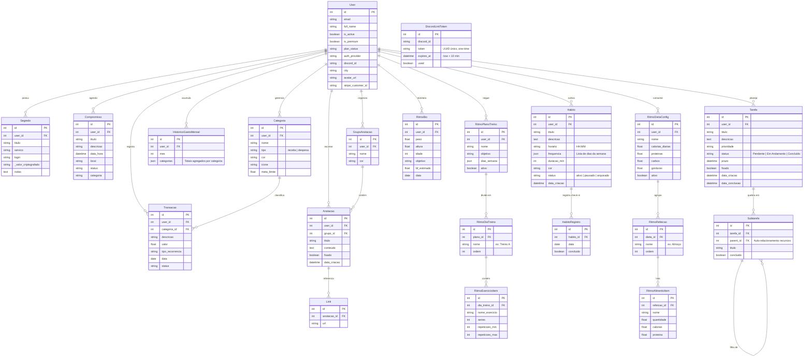

<div align="center">

  

  <br>
  <br>

  
  
  

  <br>

  
  
  

  <br>

  
  

</div>

---

O **Bússola V2** é a resposta definitiva para a fragmentação da vida moderna. Projetado como um **Sistema Operacional Pessoal**, ele elimina a necessidade de alternar entre múltiplos aplicativos desconexos (planilhas financeiras, apps de treino, notas soltas e agendas), unificando todos os aspectos vitais da sua rotina em uma única plataforma inteligente e segura.

> [!TIP]
> Atuando como um hub central de dados, o sistema oferece uma visão de 360º sobre sua performance pessoal. Ele cruza informações de **Finanças** e **Saúde** para gerar *insights*, utiliza **Inteligência Artificial** para otimizar sua rotina e fornece um **Panorama** em tempo real com métricas decisivas para o seu dia a dia.

Seja para gerenciar o fluxo de caixa, monitorar a dieta ou blindar senhas sensíveis, o Bússola V2 coloca você no controle total, transformando dados brutos em clareza mental e ação.

# Índice

- [Índice](#índice)
  - [🗺️ Roadmap](#️-roadmap)
    - [✅ Concluído (Fase 1: Fundação)](#-concluído-fase-1-fundação)
    - [🚧 Em Desenvolvimento (Fase 2: Inteligência \& Infra)](#-em-desenvolvimento-fase-2-inteligência--infra)
    - [🔭 Futuro (Fase 3: Expansão)](#-futuro-fase-3-expansão)
- [🛠️ Tecnologias Usadas](#️-tecnologias-usadas)
  - [🎨 Frontend (SPA)](#-frontend-spa)
  - [⚙️ Backend \& Dados](#️-backend--dados)
  - [🤖 Inteligência Artificial (Agentic Workflow)](#-inteligência-artificial-agentic-workflow)
  - [🎮 Discord Bot](#-discord-bot)
- [📂 Estrutura](#-estrutura)
- [📦 Módulos do Sistema](#-módulos-do-sistema)
- [📐 Diagrama de Entidade-Relacionamento (ERD)](#-diagrama-de-entidade-relacionamento-erd)
- [📚 Documentação da API](#-documentação-da-api)
- [🐳 Deploy com Docker](#-deploy-com-docker)
  - [🏗️ Arquitetura dos Containers](#️-arquitetura-dos-containers)
  - [🚀 Como Rodar](#-como-rodar)
    - [Pré-requisitos](#pré-requisitos)
    - [Passo a Passo](#passo-a-passo)
  - [⚙️ Detalhes Técnicos Importantes](#️-detalhes-técnicos-importantes)
    - [💾 Persistência de Dados (SQLite)](#-persistência-de-dados-sqlite)
    - [🌐 Variáveis de Ambiente e Networking](#-variáveis-de-ambiente-e-networking)
    - [🛠️ Comandos Úteis](#️-comandos-úteis)
- [🎮 Discord Bot (`bussola_bot`)](#-discord-bot-bussola_bot)
  - [🏗️ Arquitetura](#️-arquitetura)
  - [⚙️ Configuração](#️-configuração)
  - [🎯 Slash Commands](#-slash-commands)
  - [🔗 Fluxo de Vinculação de Conta](#-fluxo-de-vinculação-de-conta)
- [📊 Observabilidade & Logging](#-observabilidade--logging)
  - [Arquitetura do Sistema de Logs](#arquitetura-do-sistema-de-logs)
  - [O que cada camada emite](#o-que-cada-camada-emite)
  - [Controle de Nível de Log](#controle-de-nível-de-log)
  - [Rotação de Logs (Docker)](#rotação-de-logs-docker)
  - [Campos Sensíveis — Conformidade LGPD](#campos-sensíveis--conformidade-lgpd)
- [🤝 Agradecimentos e Contato](#-agradecimentos-e-contato)
  - [Dúvidas, Bugs ou Sugestões?](#dúvidas-bugs-ou-sugestões)
  - [Vamos nos Conectar!](#vamos-nos-conectar)

---

## 🗺️ Roadmap

O desenvolvimento do **Bússola V2** é contínuo, evoluindo de um sistema de gestão pessoal para um **ecossistema inteligente**. Abaixo, o status atual e os planos futuros:

### ✅ Concluído (Fase 1: Fundação)

- [x] **Core da Arquitetura:** Estrutura `Monorepo` (`FastAPI` + `React`) e configuração de ambiente.
- [x] **Segurança:** Autenticação `JWT`, Hashing de senhas e proteção de rotas (`CORS`/`Middlewares`).
- [x] **Camada de Dados:** Modelagem relacional complexa (`SQLAlchemy`) e Migrações (`Alembic`).
- [x] **Módulos Essenciais:** Implementação funcional de *Finanças* (Fluxo de Caixa), *Ritmo* (Treino/Dieta), *Registros* (Tarefas/Notas/Hábitos) e *Agenda*.
- [x] **Documentação:** Integração automática com `Scalar` e `Swagger UI`.
- [x] **Agentes de IA:** 18 agentes especializados cobrindo Finanças, Saúde, Produtividade e Agenda.
- [x] **Containerização:** Deploy completo via Docker Compose (Backend, Frontend, Bot).

### 🚧 Em Desenvolvimento (Fase 2: Inteligência & Infra)

- [x] **Discord Bot (`bussola_bot`):** Bot Discord com `discord.py` para vincular conta, consultar dados e receber notificações direto no Discord.
- [x] **Observabilidade & Logging:** Sistema de logs JSON estruturado em todas as camadas (API, Bot, Frontend, Nginx) com visibilidade nativa no Coolify.
- [ ] **ChatBot Inteligente:** Criando ChatBot inteligente interativo e dinâmico referente a toda aplicação, dados e informação.
- [ ] **Documentação:** Documentando todos os módulos e funcionalidades do projeto.
- [ ] **Comandos do Bot:** Expandir cogs do Discord Bot além de autenticação (finanças, agenda, registros, ritmo).

### 🔭 Futuro (Fase 3: Expansão)

- [ ] **Feedback Loop & Memória:** Evoluir a interface dos cards de IA com botões de Aceitar (executa a ação automaticamente) e Descartar. O descarte deve alimentar uma Blacklist no Redis para impedir que a IA repita a mesma sugestão rejeitada nos próximos dias.
- [ ] **Contexto Expandido (RAG):** Implementar Retrieval-Augmented Generation para que os agentes (ex: SpendingDetective) consultem todo o histórico do usuário via busca vetorial, eliminando a limitação de enviar apenas as "Top 30" linhas e permitindo análises estatísticas profundas.
- [ ] **Meta-Orquestração (Cross-Domain):** Criar uma camada de comunicação entre módulos, permitindo que o CFO Digital (Finanças) saiba que o usuário está em fase de Bulking (Nutrição) para não bloquear gastos essenciais de dieta, evitando conselhos contraditórios entre os agentes.
- [ ] **Mobile Experience:** Adaptação da interface para PWA (Progressive Web App) ou melhorar 100% da responsividade.
- [ ] **Interface de Voz:** Integração com Whisper para registrar gastos e tarefas via comando de voz.
- [ ] **Gamificação:** Sistema de XP e níveis baseado no cumprimento de metas financeiras e de saúde.
- [ ] **PostgreSQL:** Migrar para BD PostgreSQL no modo SaaS para maior robustez.
- [ ] **Padronização:** Refatoração global para padronizar nomes de arquivos/variáveis de todo projeto (Code Clean-up).

---

# 🛠️ Tecnologias Usadas

O projeto foi construído sobre uma **arquitetura moderna**, utilizando bibliotecas de ponta para garantir performance, reatividade e inteligência.

## 🎨 Frontend (SPA)
Interface reativa construída com **React 19**, focada em visualização de dados e edição de conteúdo.

<div style="display: inline_block"><br>
  
  
  
  
</div>

<br>

* **React 19 & Vite:** Performance extrema com a versão mais recente da biblioteca e `build tool`.
* **Chart.js:** Renderização de gráficos financeiros e biométricos para o módulo *Panorama*.
* **React Quill New:** Editor de texto rico (`WYSIWYG`) utilizado no módulo *Registros* para notas.
* **@uiw/react-md-editor:** Editor Markdown com preview em tempo real para notas avançadas.
* **Axios:** Cliente `HTTP` para comunicação eficiente com a API.
* **@react-oauth/google:** SDK oficial do Google para autenticação OAuth2 no frontend.
* **zxcvbn:** Análise de força de senha em tempo real no registro de usuário.
* **Turndown:** Conversão de HTML para Markdown para interoperabilidade de formatos de nota.

## ⚙️ Backend & Dados
API assíncrona robusta capaz de processamento pesado de dados e integrações externas.

<div style="display: inline_block"><br>
  
  
  
  
</div>

<br>

* **FastAPI:** Framework central para a `API RESTful` assíncrona.
* **Pandas & NumPy:** Processamento analítico de dados financeiros e de saúde para os agentes de IA.
* **SQLAlchemy & Alembic:** `ORM` e versionamento de banco de dados.
* **aiosmtplib:** Envio assíncrono de e-mails transacionais (verificação de conta, reset de senha).
* **slowapi:** Rate limiting por IP para proteção dos endpoints públicos.
* **cryptography (Fernet):** Criptografia simétrica para o módulo *Cofre* (vault de senhas).
* **python-jose:** Geração e verificação de tokens `JWT`.
* **bcrypt:** Hashing seguro de senhas.

## 🤖 Inteligência Artificial (Agentic Workflow)
O diferencial do projeto: uma arquitetura de **múltiplos agentes orquestrados**.

<div style="display: inline_block"><br>
  
  
  
  
</div>

<br>

* **LangGraph:** Orquestração de agentes estatais cíclicos (`Stateful Multi-Agent`), permitindo fluxos de raciocínio complexos com execução paralela.
* **LangChain:** Framework base para integração com `LLMs`.
* **Modelos:** Suporte híbrido para **Google GenAI** (`Gemini`), **Groq** (`Llama` de baixa latência) e **OpenAI**, controlado pela variável `LLM_PROVIDER`.

## 🎮 Discord Bot

<div style="display: inline_block"><br>
  
  
</div>

<br>

* **discord.py:** Framework assíncrono para o bot Discord com slash commands e sistema de cogs.
* **aiohttp:** Servidor `HTTP` interno (porta `8001`) que recebe notificações push do Backend e as entrega como mensagens DM no Discord.
* **APScheduler:** Agendador de tarefas para funcionalidades de notificação periódica.

---

# 📂 Estrutura

> [!NOTE]
> O projeto segue uma arquitetura de **Monorepo**, dividindo claramente as responsabilidades entre a API de dados (`Backend`), a interface do usuário (`Frontend`) e o bot de comunicação (`Discord Bot`).

```text
Bussola-v2/
├── 📁 bussola_api/           # Backend (Python/FastAPI)
│   ├── 📂 alembic/           # Migrações de Banco de Dados
│   ├── 📂 app/
│   │   ├── 📂 api/
│   │   │   ├── 📂 middleware/ # RequestLoggingMiddleware (request_id, timing)
│   │   │   ├── 📄 deps.py    # Dependency injection (get_current_user, get_db)
│   │   │   ├── 📄 bot_deps.py # Autenticação do bot (X-Bot-Service-Token)
│   │   │   └── 📂 v1/        # Endpoints e Rotas
│   │   │       ├── 📄 router.py           # Agregador central de todas as rotas
│   │   │       └── 📂 endpoints/
│   │   │           ├── 📄 auth.py         # Login, registro, OAuth Google, refresh, logout
│   │   │           ├── 📄 users.py        # Perfil do usuário (/users/me)
│   │   │           ├── 📄 agenda.py       # Compromissos (CRUD)
│   │   │           ├── 📄 financas.py     # Transações e categorias
│   │   │           ├── 📄 registros.py    # Notas, tarefas, hábitos
│   │   │           ├── 📄 ritmo.py        # Bio, treino, dieta
│   │   │           ├── 📄 cofre.py        # Vault criptografado
│   │   │           ├── 📄 panorama.py     # Dashboard e BI
│   │   │           ├── 📄 home.py         # Widgets externos (clima, notícias)
│   │   │           ├── 📄 ai.py           # Endpoints de insights de IA
│   │   │           ├── 📄 system.py       # Endpoints de administração
│   │   │           ├── 📄 bot_auth.py     # Autenticação bot ↔ backend
│   │   │           └── 📄 discord_link.py # Fluxo de vinculação Discord
│   │   ├── 📂 core/          # Configurações globais
│   │   │   ├── 📄 config.py       # Pydantic Settings (env vars)
│   │   │   ├── 📄 logging_config.py # BussolaJsonFormatter
│   │   │   ├── 📄 security.py     # JWT, hashing, Fernet
│   │   │   └── 📄 timezone.py     # Utilitários UTC/America/Sao_Paulo
│   │   ├── 📂 db/            # Configuração do Banco de Dados (Session)
│   │   ├── 📂 models/        # Modelos ORM (SQLAlchemy)
│   │   │   ├── 📄 user.py
│   │   │   ├── 📄 agenda.py
│   │   │   ├── 📄 financas.py
│   │   │   ├── 📄 registros.py    # Inclui Habito e HabitoRegistro
│   │   │   ├── 📄 ritmo.py
│   │   │   ├── 📄 cofre.py
│   │   │   └── 📄 discord_link_token.py
│   │   ├── 📂 schemas/       # Schemas Pydantic (Serialização/Validação)
│   │   ├── 📂 services/      # Lógica de Negócio
│   │   │   └── 📂 ai/        # 🤖 Camada de Agentes Inteligentes
│   │   │       ├── 📂 base/  # Infraestrutura compartilhada (llm_factory, cache, post_processor)
│   │   │       ├── 📂 financas/   # CFO Digital (4 agentes)
│   │   │       ├── 📂 ritmo/      # Coach + Nutri (6 agentes)
│   │   │       ├── 📂 registros/  # Produtividade (4 agentes, LangGraph)
│   │   │       └── 📂 roteiro/    # Agenda (4 agentes)
│   │   └── 📂 utils/         # Utilitários (e-mail)
│   ├── 📂 scripts/           # Scripts de setup e automação
│   ├── 📂 seeds/             # Dados de seed para desenvolvimento
│   └── 📄 requirements.txt
│
├── 📁 bussola_bot/           # Discord Bot (discord.py)
│   ├── 📂 bot/
│   │   ├── 📂 cogs/          # Grupos de slash commands
│   │   │   ├── 📄 auth.py         # /start, /vincular — fluxo de vinculação
│   │   │   ├── 📄 financas.py     # Comandos de finanças (em desenvolvimento)
│   │   │   ├── 📄 agenda.py       # Comandos de agenda (em desenvolvimento)
│   │   │   ├── 📄 registros.py    # Comandos de registros (em desenvolvimento)
│   │   │   ├── 📄 ritmo.py        # Comandos de saúde (em desenvolvimento)
│   │   │   └── 📄 configuracoes.py # Configurações do bot (em desenvolvimento)
│   │   ├── 📄 client.py      # BussolaBot — setup e eventos
│   │   ├── 📄 api_client.py  # BussolaAPIClient — wrapper aiohttp para o Backend
│   │   ├── 📄 webhook.py     # Servidor aiohttp (porta 8001) para notificações
│   │   └── 📄 logger.py      # Logging JSON estruturado
│   ├── 📄 main.py
│   └── 📄 requirements.txt
│
├── 📁 bussola_web/           # Frontend (React/Vite)
│   ├── 📂 public/            # Assets estáticos públicos
│   ├── 📂 src/
│   │   ├── 📂 assets/        # Imagens e Estilos globais
│   │   ├── 📂 components/    # Componentes de UI Reutilizáveis
│   │   │   ├── 📄 ErrorBoundary.tsx  # Captura erros de render, exibe fallback UI
│   │   │   ├── 📂 Navbar/    # Barra de navegação
│   │   │   ├── 📂 AiAssistant/ # Interface do assistente de IA
│   │   │   ├── 📂 UserDrawer/ # Drawer lateral de perfil
│   │   │   └── ...           # BaseModal, CustomSelect, CitySelector, Pickers
│   │   ├── 📂 context/       # Estado Global (Auth, System, Toast, ConfirmDialog)
│   │   ├── 📂 pages/         # Telas dos Módulos
│   │   │   ├── 📂 Auth/      # Login, Register, ForgotPassword, ResetPassword, DiscordLink
│   │   │   ├── 📂 Home/      # Dashboard com widgets de clima e notícias
│   │   │   ├── 📂 Agenda/
│   │   │   ├── 📂 Financas/
│   │   │   ├── 📂 Registros/ # Notas, Tarefas, Hábitos (Jornada)
│   │   │   ├── 📂 Ritmo/
│   │   │   ├── 📂 Cofre/
│   │   │   └── 📂 Panorama/
│   │   ├── 📂 routes/        # Configuração do React Router
│   │   ├── 📂 services/
│   │   │   └── 📄 api.ts     # Cliente HTTP (Axios) — todos os endpoints da API
│   │   └── 📂 utils/
│   │       └── 📄 logger.ts  # Logger JSON tipado para o frontend
│   ├── 📄 nginx.conf         # Proxy reverso + access log JSON
│   └── 📄 package.json
│
└── 📁 docs/                  # Documentação por módulo
```

---

# 📦 Módulos do Sistema

O **Bússola V2** é composto por subsistemas independentes que conversam entre si. Para entender as **regras de negócio**, fluxos e detalhes técnicos de cada um, acesse a documentação específica:

| Módulo | Descrição | Doc |
| :--- | :--- | :---: |
| **🔭 Panorama (BI)** | Central de Inteligência que agrega dados de todos os módulos para gerar `KPIs`, gráficos (`Chart.js`) e relatórios unificados. | [Ler ➔](docs/PANORAMA.md) |
| **🔐 Segurança & Auth** | Gestão de usuários, autenticação `JWT`, `hashing` de senhas, Google OAuth2 e controle de sessão. | [Ler ➔](docs/SECURITY.md) |
| **💰 Finanças** | Controle de fluxo de caixa, categorias, transações recorrentes e relatórios financeiros. | [Ler ➔](docs/FINANCE.md) |
| **💪 Ritmo (Saúde)** | Fichas de treino, controle de dieta, `macros`, `bio-tracking` (peso, BF, TMB). | [Ler ➔](docs/RITMO.md) |
| **🧠 Registros** | Segundo cérebro: notas (Markdown/WYSIWYG), gestão de tarefas hierárquicas e rastreamento de hábitos. | [Ler ➔](docs/REGISTROS.md) |
| **📅 Agenda** | Gestão temporal, compromissos e integração com a rotina. | [Ler ➔](docs/AGENDA.md) |
| **🛡️ Cofre** | `Vault` criptografado com Fernet para armazenamento de segredos e senhas. | [Ler ➔](docs/COFRE.md) |
| **🤖 Inteligência Artificial** | Orquestração de 18 agentes (`LangGraph`) que atuam como Nutricionista, Coach, CFO Digital e Assistente de Agenda. | [Ler ➔](docs/AI.md) |
| **⚙️ Sistema & Core** | Configurações globais, `health checks`, `middlewares` e infraestrutura. | [Ler ➔](docs/SYSTEM.md) |
| **🎮 Discord Bot** | Vinculação de conta, comandos slash e notificações via DM. | [Ler ➔](docs/DISCORD_BOT.md) |

---

## 🤖 Agentes de Inteligência Artificial

A camada de IA é composta por **18 agentes especializados**, distribuídos em 4 domínios, cada um orquestrado por um fluxo `LangGraph`. Todos retornam `AtomicSuggestion` — contratos padronizados com prioridade, ação executável e evidência.

### Domínio Financeiro — CFO Digital (`/ai/financas/insight`)

| Agente | Responsabilidade |
| :--- | :--- |
| **SpendingDetective** | Detecta anomalias de gasto comparando com o histórico dos meses anteriores |
| **BudgetSentinel** | Monitora a execução do orçamento no mês atual vs. metas definidas por categoria |
| **CashFlowOracle** | Projeta a liquidez dos próximos 30 dias com base em receitas e despesas recorrentes |
| **StrategyArchitect** | Sugere estratégias de longo prazo para construção de patrimônio |

### Domínio Saúde — Coach + Nutricionista (`/ai/ritmo/insight`)

**Coach (Treino):**

| Agente | Responsabilidade |
| :--- | :--- |
| **IntensityStrategist** | Ajusta a intensidade do treino com base nos dados biométricos e objetivos |
| **TechniqueMaster** | Identifica oportunidades de otimização de técnica nos exercícios do plano |
| **VolumeArchitect** | Planeja o volume semanal de treino considerando recuperação e progressão |

**Nutri (Nutrição):**

| Agente | Responsabilidade |
| :--- | :--- |
| **MacroAuditor** | Analisa o balanço de macronutrientes (proteína, carboidrato, gordura) |
| **MealDetective** | Examina a composição das refeições individuais |
| **VarietyExpert** | Sugere diversidade alimentar para evitar monotonia e lacunas nutricionais |

### Domínio Produtividade — Registros (`/ai/registros/insight`)

Orquestrado via **LangGraph state machine** com execução paralela dos agentes.

| Agente | Responsabilidade |
| :--- | :--- |
| **TimeStrategist** | Planejamento de foco diário ("O que fazer hoje?") |
| **FlowArchitect** | Balanceamento semanal de contextos para preservar foco profundo |
| **PriorityAlchemist** | Limpeza de backlog por idade, relevância e energia necessária |
| **TaskBreaker** | Decomposição de tarefas grandes em subtarefas acionáveis |

### Domínio Agenda — Roteiro (`/ai/roteiro/insight`)

| Agente | Responsabilidade |
| :--- | :--- |
| **ConflictGuardian** | Detecta conflitos e sobreposições de horários |
| **DensityAuditor** | Analisa a concentração de compromissos e identifica dias superlotados |
| **RecoveryAgent** | Sugere blocos de recuperação e buffer entre compromissos intensos |
| **TravelMarshal** | Otimiza tempos de deslocamento entre compromissos por localização |

### Infraestrutura de IA (`app/services/ai/base/`)

| Arquivo | Responsabilidade |
| :--- | :--- |
| `llm_factory.py` | Abstração de provedor — troca entre Groq, Gemini e OpenAI via `LLM_PROVIDER` |
| `base_schema.py` | Contrato universal `AtomicSuggestion` (priority, actionable, evidence) |
| `post_processor.py` | Sanitização da saída do LLM, deduplicação e fuzzy-match de ações |
| `cache.py` | Cache de resultados para evitar chamadas redundantes ao LLM |

---

# 📐 Diagrama de Entidade-Relacionamento (ERD)

> [!IMPORTANT]
> O diagrama abaixo ilustra a estrutura do banco de dados, evidenciando o modelo **User-Centric**, onde todas as funcionalidades (Finanças, Saúde, Produtividade) orbitam em torno da entidade `User` para garantir a privacidade e isolamento dos dados (`Multi-tenancy`).


```mermaid
erDiagram
    %% ==========================================
    %% NÚCLEO (Core & Auth)
    %% ==========================================
    User {
        int id PK
        string email
        string full_name
        boolean is_active
        boolean is_premium
        string plan_status
        string auth_provider
        string discord_id
        string city
        string avatar_url
        string stripe_customer_id
    }

    Segredo {
        int id PK
        int user_id FK
        string titulo
        string servico
        string login
        string _valor_criptografado
        text notas
    }

    Compromisso {
        int id PK
        int user_id FK
        string titulo
        string descricao
        datetime data_hora
        string local
        string status
        string categoria
    }

    DiscordLinkToken {
        int id PK
        string discord_id
        string token "UUID único, one-time"
        datetime expires_at "now + 10 min"
        boolean used
    }

    %% ==========================================
    %% MÓDULO FINANÇAS
    %% ==========================================
    Categoria {
        int id PK
        int user_id FK
        string nome
        string tipo "receita | despesa"
        string cor
        string icone
        float meta_limite
    }

    Transacao {
        int id PK
        int user_id FK
        int categoria_id FK
        string descricao
        float valor
        string tipo_recorrencia
        date data
        string status
    }

    HistoricoGastoMensal {
        int id PK
        int user_id FK
        int mes
        json categorias "Totais agregados por categoria"
    }

    %% ==========================================
    %% MÓDULO REGISTROS (Produtividade)
    %% ==========================================
    GrupoAnotacao {
        int id PK
        int user_id FK
        string nome
        string cor
    }

    Anotacao {
        int id PK
        int user_id FK
        int grupo_id FK
        string titulo
        text conteudo
        boolean fixado
        datetime data_criacao
    }

    Link {
        int id PK
        int anotacao_id FK
        string url
    }

    Tarefa {
        int id PK
        int user_id FK
        string titulo
        text descricao
        string prioridade
        string status "Pendente | Em Andamento | Concluído"
        datetime prazo
        boolean fixado
        datetime data_criacao
        datetime data_conclusao
    }

    Subtarefa {
        int id PK
        int tarefa_id FK
        int parent_id FK "Auto-relacionamento recursivo"
        string titulo
        boolean concluido
    }

    Habito {
        int id PK
        int user_id FK
        string titulo
        text descricao
        string horario "HH:MM"
        json frequencia "Lista de dias da semana"
        int duracao_min
        string cor
        string status "ativo | pausado | arquivado"
        datetime data_criacao
    }

    HabitoRegistro {
        int id PK
        int habito_id FK
        date data
        boolean concluido
    }

    %% ==========================================
    %% MÓDULO RITMO (Saúde & Treino)
    %% ==========================================
    RitmoBio {
        int id PK
        int user_id FK
        float peso
        float altura
        int idade
        string objetivo
        float bf_estimado
        date data
    }

    RitmoPlanoTreino {
        int id PK
        int user_id FK
        string nome
        string objetivo
        json dias_semana
        boolean ativo
    }

    RitmoDiaTreino {
        int id PK
        int plano_id FK
        string nome "ex: Treino A"
        int ordem
    }

    RitmoExercicioItem {
        int id PK
        int dia_treino_id FK
        string nome_exercicio
        int series
        int repeticoes_min
        int repeticoes_max
    }

    RitmoDietaConfig {
        int id PK
        int user_id FK
        string nome
        float calorias_diarias
        float proteinas
        float carbos
        float gorduras
        boolean ativo
    }

    RitmoRefeicao {
        int id PK
        int dieta_id FK
        string nome "ex: Almoço"
        int ordem
    }

    RitmoAlimentoItem {
        int id PK
        int refeicao_id FK
        string nome
        float quantidade
        float calorias
        float proteina
    }

    %% ==========================================
    %% RELACIONAMENTOS (User é o centro)
    %% ==========================================

    %% Core Relationships
    User ||--o{ Segredo : "possui"
    User ||--o{ Compromisso : "agenda"

    %% Finanças
    User ||--o{ Categoria : "gerencia"
    User ||--o{ Transacao : "registra"
    Categoria ||--o{ Transacao : "classifica"
    User ||--o{ HistoricoGastoMensal : "acumula"

    %% Registros
    User ||--o{ GrupoAnotacao : "organiza"
    User ||--o{ Anotacao : "escreve"
    User ||--o{ Tarefa : "planeja"
    User ||--o{ Habito : "cultiva"
    GrupoAnotacao ||--o{ Anotacao : "contém"
    Anotacao ||--o{ Link : "referencia"
    Tarefa ||--o{ Subtarefa : "quebra em"
    Subtarefa ||--o{ Subtarefa : "filha de"
    Habito ||--o{ HabitoRegistro : "registra check-in"

    %% Ritmo (Saúde)
    User ||--o{ RitmoBio : "monitora"
    User ||--o{ RitmoPlanoTreino : "segue"
    User ||--o{ RitmoDietaConfig : "consome"

    %% Ritmo - Estrutura de Treino
    RitmoPlanoTreino ||--o{ RitmoDiaTreino : "divide em"
    RitmoDiaTreino ||--o{ RitmoExercicioItem : "contém"

    %% Ritmo - Estrutura de Dieta
    RitmoDietaConfig ||--o{ RitmoRefeicao : "agrupa"
    RitmoRefeicao ||--o{ RitmoAlimentoItem : "lista"
```

---

# 📚 Documentação da API

O `backend` do **Bússola V2** gera automaticamente a documentação de todos os `endpoints` seguindo o padrão **OpenAPI**. Você pode escolher a interface que melhor se adapta ao seu fluxo de trabalho:

| Interface | Rota Local | Melhor uso para... |
| :--- | :--- | :--- |
| **Scalar** (Moderno) | [`/scalar`](http://localhost:8000/scalar) | ✨ **Visualização & Consumo:** Design moderno (Dark Mode), busca rápida (`Ctrl+K`) e gera exemplos de código prontos (`cURL`, `Python`, `JS`) para cada rota. |
| **Swagger UI** (Clássico) | [`/docs`](http://localhost:8000/docs) | 🧪 **Testes & Debug:** Interface padrão do `FastAPI`. Ideal para executar requisições rápidas ("Try it out") e testar validações de erro. |
| **ReDoc** | [`/redoc`](http://localhost:8000/redoc) | 📖 **Leitura Técnica:** Layout focado em leitura de documentação estática, excelente para entender a estrutura dos `schemas JSON` e modelos de dados. |

> [!TIP]
> **Nota:** Para importar a coleção no **Postman** ou **Insomnia**, utilize o `JSON` bruto disponível em:
> [`http://localhost:8000/api/v1/openapi.json`](http://localhost:8000/api/v1/openapi.json)

---

# 🐳 Deploy com Docker

Para facilitar a execução em qualquer ambiente e garantir a paridade entre desenvolvimento e produção, o **Bússola V2** foi containerizado. Utilizamos o **Docker Compose** para orquestrar três serviços distintos, cada um com sua responsabilidade e otimização específica.

## 🏗️ Arquitetura dos Containers

```
┌─────────────────────────────────────────────────────────┐
│                     Coolify / Proxy                     │
│         (roteamento externo e terminação TLS)           │
└──────────────┬──────────────────┬───────────────────────┘
               │                  │
    ┌──────────▼──────┐  ┌───────▼────────┐
    │ bussola_frontend│  │  bussola_bot   │
    │  (Nginx + React)│  │  (discord.py)  │
    │  Multi-stage    │  │  Porta 8001    │
    │  build          │  │  (webhook)     │
    └──────────┬──────┘  └───────┬────────┘
               │ /api/v1         │ http interno
               └────────┬────────┘
                ┌────────▼────────┐
                │ bussola_backend │
                │  (FastAPI)      │
                │  Porta 8000     │
                │  Volume: /data  │
                └─────────────────┘
```

**Descrição dos serviços:**

1. **`bussola_backend`:**
   * Construído a partir de `python:3.12-slim`.
   * Roda o servidor `Uvicorn` na porta interna `8000`.
   * Responsável pela lógica de negócios, acesso ao SQLite e comunicação com LLMs.
   * Variável `BOT_WEBHOOK_URL` aponta para `http://bussola_bot:8001` (rede interna).

2. **`bussola_frontend`** (service name: `frontend`, container: `bussola_frontend`):
   * Utiliza **Multi-stage Build**:
     1. **Stage 1 (Node):** Compila o código React/Vite para arquivos estáticos.
     2. **Stage 2 (Nginx):** Descarta o Node e serve os arquivos com Nginx Alpine.
   * Atua como **Proxy Reverso**: Redireciona chamadas de `/api/v1` para o `bussola_backend`.
   * Não expõe porta diretamente — o tráfego externo é roteado pelo Coolify.

3. **`bussola_bot`:**
   * Serviço independente rodando o Discord Bot.
   * Expõe a porta interna `8001` para receber webhooks do backend.
   * Conecta-se ao backend via rede interna `http://bussola_backend:8000`.

> [!NOTE]
> **Rede `coolify`:** O `docker-compose.yml` usa uma rede externa `coolify` criada pelo Coolify para roteamento e TLS automático. Ao rodar localmente sem Coolify, você precisará criar a rede manualmente ou ajustar o compose.

---

## 🚀 Como Rodar

### Pré-requisitos
* [Docker](https://www.docker.com/get-started) e Docker Compose instalados.
* Conta e chaves de API para pelo menos um provedor LLM (Groq, Gemini ou OpenAI).

### Passo a Passo

1.  **Clone o repositório:**
    ```bash
    git clone https://github.com/Marocosz/Bussola-v2.git
    cd Bussola-v2
    ```

2.  **Configure o ambiente do Backend:**
    Copie o template e preencha as variáveis:
    ```bash
    cp bussola_api/.env.example bussola_api/.env
    ```
    Edite `bussola_api/.env` com suas chaves (veja a seção de variáveis abaixo).

3.  **Configure o ambiente do Bot (opcional):**
    ```bash
    cp bussola_bot/.env.example bussola_bot/.env
    ```

4.  **Crie a rede do Coolify (apenas para deploy local sem Coolify):**
    ```bash
    docker network create coolify
    ```

5.  **Suba a aplicação:**
    Na raiz do projeto (onde está o `docker-compose.yml`), execute:
    ```bash
    docker compose up -d --build
    ```
    * `-d`: Roda em segundo plano (Detached).
    * `--build`: Força a recriação das imagens se houver alterações no código.

6.  **Execute as migrações do banco de dados:**
    ```bash
    docker compose exec bussola_backend alembic upgrade head
    ```

7.  **Crie o primeiro usuário (modo SELF_HOSTED):**
    ```bash
    docker compose exec bussola_backend python scripts/create_user.py \
      --email admin@example.com --password suasenha
    ```

8.  **Acesse:**
    * 📚 **Documentação API:** `http://localhost:8000/docs` (acesso direto ao backend)

> [!NOTE]
> **Desenvolvimento local sem Docker:** Use `uvicorn app.main:app --reload` no backend e `npm run dev` no frontend. O frontend em dev chama `http://127.0.0.1:8000` diretamente, sem precisar do Nginx.

---

## ⚙️ Detalhes Técnicos Importantes

### 💾 Persistência de Dados (SQLite)
O volume do Docker garante que o banco não seja perdido ao recriar containers:

```yaml
volumes:
  - ./bussola_api/data:/app/data
```

O arquivo `bussola.db` dentro do container espelha `bussola_api/data/bussola.db` na sua máquina. Você pode parar, destruir e recriar os containers quantas vezes quiser; seus dados permanecerão intactos.

### 🌐 Variáveis de Ambiente

#### Backend (`bussola_api/.env`)

```env
# Aplicação
PROJECT_NAME=Bussola API
DEPLOYMENT_MODE=SELF_HOSTED           # SELF_HOSTED | SAAS
ENABLE_PUBLIC_REGISTRATION=false      # true para permitir auto-cadastro público

# Segurança
SECRET_KEY=                           # openssl rand -hex 32
ENCRYPTION_KEY=                       # Fernet key (from cryptography.fernet import Fernet; Fernet.generate_key())
ALGORITHM=HS256
ACCESS_TOKEN_EXPIRE_MINUTES=1440      # 24h por padrão
REFRESH_TOKEN_EXPIRE_DAYS=7

# Banco de Dados
DATABASE_URL=sqlite:///./data/bussola.db

# Inteligência Artificial
LLM_PROVIDER=groq                     # groq | gemini | openai
LLM_MODEL_NAME=                       # Opcional: override do modelo padrão do provedor
GROQ_API_KEY=
GEMINI_API_KEY=
OPENAI_API_KEY=

# Integrações Externas
OPENWEATHER_API_KEY=                  # Widgets de clima na Home
NEWS_API_KEY=                         # Widget de notícias na Home
GOOGLE_CLIENT_ID=                     # OAuth Google
GOOGLE_CLIENT_SECRET=
STRIPE_SECRET_KEY=                    # Pagamentos (modo SaaS)
DISCORD_BOT_TOKEN=                    # Token do bot Discord (para notificações do backend)

# E-mail
MAIL_SERVER=smtp.gmail.com
MAIL_PORT=587
MAIL_USERNAME=
MAIL_PASSWORD=
MAIL_FROM=

# URLs
FRONTEND_URL=http://localhost:5173    # URL pública do frontend (usada em links de e-mail)
```

#### Bot (`bussola_bot/.env`)

```env
DISCORD_BOT_TOKEN=                    # Token do Portal de Desenvolvedor Discord
BOT_SERVICE_TOKEN=                    # Token compartilhado backend ↔ bot (gere um UUID aleatório)
API_BASE_URL=http://localhost:8000    # Em Docker: http://bussola_backend:8000
FRONTEND_URL=http://localhost:5173    # URL pública do frontend
LOG_LEVEL=INFO
```

### 🛠️ Comandos Úteis

| Ação | Comando |
| :--- | :--- |
| **Ver logs em tempo real** | `docker compose logs -f` |
| **Logs de um serviço específico** | `docker compose logs -f bussola_backend` |
| **Parar e remover containers** | `docker compose down` |
| **Status dos containers** | `docker compose ps` |
| **Executar migração** | `docker compose exec bussola_backend alembic upgrade head` |
| **Abrir shell no backend** | `docker compose exec bussola_backend bash` |
| **Reset total (destrói volumes)** | `docker compose down -v --rmi all` |

---

# 🎮 Discord Bot (`bussola_bot`)

O **Bússola Bot** é a interface do sistema no Discord. Ele permite que o usuário vincule sua conta Bussola ao Discord e receba notificações, com estrutura preparada para futura expansão de comandos.

## 🏗️ Arquitetura

O bot é um serviço independente que roda em seu próprio container e se comunica com o backend via HTTP interno:

```
Discord ←→ bussola_bot ←→ bussola_backend (http://bussola_backend:8000)
                ↑
       Webhook Server (porta 8001)
       Recebe notificações push do backend
```

**Componentes principais:**

| Arquivo | Responsabilidade |
| :--- | :--- |
| `bot/client.py` | `BussolaBot` — inicialização, carregamento de cogs, eventos `on_ready` |
| `bot/api_client.py` | `BussolaAPIClient` — wrapper assíncrono (`aiohttp`) para o backend |
| `bot/webhook.py` | Servidor `aiohttp` na porta `8001` que recebe eventos do backend e os entrega como DMs |
| `bot/cogs/auth.py` | Slash commands `/start`, `/vincular` — fluxo de vinculação de conta |
| `bot/logger.py` | Configuração do logging JSON estruturado do bot |

## ⚙️ Configuração

O bot requer as seguintes variáveis de ambiente:

| Variável | Descrição |
| :--- | :--- |
| `DISCORD_BOT_TOKEN` | Token do bot gerado no Discord Developer Portal |
| `BOT_SERVICE_TOKEN` | Token compartilhado para autenticar chamadas backend → bot (webhook) |
| `API_BASE_URL` | URL interna do backend (`http://bussola_backend:8000` em Docker) |
| `FRONTEND_URL` | URL pública do frontend, usada para gerar links de vinculação |
| `LOG_LEVEL` | Nível de log (`DEBUG`, `INFO`, `WARNING`) — padrão: `INFO` |

## 🎯 Slash Commands

| Comando | Cog | Status | Descrição |
| :--- | :--- | :---: | :--- |
| `/start` | `auth.py` | ✅ Implementado | Verifica se a conta está vinculada e inicia o fluxo |
| `/vincular` | `auth.py` | ✅ Implementado | Gera link de vinculação com TTL de 10 minutos |
| Comandos de Finanças | `financas.py` | 🚧 Em desenvolvimento | Consultar saldo, lançar transações |
| Comandos de Agenda | `agenda.py` | 🚧 Em desenvolvimento | Ver compromissos do dia |
| Comandos de Registros | `registros.py` | 🚧 Em desenvolvimento | Consultar tarefas e notas |
| Comandos de Ritmo | `ritmo.py` | 🚧 Em desenvolvimento | Ver métricas de saúde |
| Configurações | `configuracoes.py` | 🚧 Em desenvolvimento | Preferências do bot |

## 🔗 Fluxo de Vinculação de Conta — Detalhes Técnicos

A vinculação conecta um `discord_id` (snowflake do Discord) a um `user_id` da tabela `users` do Bussola. O fluxo usa um **one-time token** com TTL de 10 minutos e é composto por 4 fases:

### Fase 1 — Verificação de Status (`/start` ou `/vincular`)

O usuário digita `/start` no Discord. O cog `AuthCog` chama:

```python
# bot/api_client.py — BussolaAPIClient.check_link_status()
GET /api/v1/bot/auth/link-status?discord_id=<snowflake>
Headers: X-Bot-Service-Token: <BOT_SERVICE_TOKEN>
```

Se já vinculado, responde com mensagem de confirmação. Caso contrário, exibe um `discord.Embed` com um botão "Vincular Conta 🔗".

### Fase 2 — Geração do Token de Vinculação

Ao clicar no botão (ou usar `/vincular`), o bot chama:

```python
# bot/api_client.py — BussolaAPIClient.request_link_token()
POST /api/v1/bot/auth/link-token
Headers: X-Bot-Service-Token: <BOT_SERVICE_TOKEN>
Body:    {"discord_id": "<snowflake>"}

# Resposta:
{"token": "<uuid>"}
```

O backend persiste o token na tabela `discord_link_tokens`:

| Campo | Tipo | Descrição |
| :--- | :--- | :--- |
| `token` | `String` (UUID, único) | One-time token |
| `discord_id` | `String` | Snowflake do usuário Discord |
| `expires_at` | `DateTime` | `now + 10 minutos` |
| `used` | `Boolean` | Marcado `True` após uso |

O bot monta a URL e envia via mensagem efêmera:
```
{FRONTEND_URL}/discord/link?token=<uuid>
```

### Fase 3 — Confirmação pelo Frontend

O usuário abre o link no browser, está logado (ou faz login/OAuth Google) no Bussola, e o frontend chama:

```python
# bussola_api/app/api/v1/endpoints/discord_link.py
POST /api/v1/discord/confirm
Auth: Bearer <JWT do usuário logado>
Body: {"token": "<uuid>"}
```

O endpoint valida:
1. Token existe e `used == False`
2. Token não expirou (`expires_at > utcnow()`)
3. O `discord_id` do token não está vinculado a **outra** conta

Se tudo ok, grava `user.discord_id = token.discord_id` e marca `token.used = True`.

### Fase 4 — Notificação de Retorno ao Bot (Webhook Push)

Após o `db.commit()`, o endpoint dispara uma `BackgroundTask` assíncrona:

```python
# discord_link.py — _notify_bot()
POST {BOT_WEBHOOK_URL}/webhook/discord-linked
Headers: X-Bot-Service-Token: <BOT_SERVICE_TOKEN>
Body:    {"discord_id": "<snowflake>"}
```

O servidor `aiohttp` do bot recebe, valida o token de serviço, busca o usuário Discord e envia uma DM:

> ✅ **Conta vinculada com sucesso!**
> Você já pode usar todos os comandos. Digite `/start` para ver o que posso fazer.

### Diagrama completo

```
Discord User          bussola_bot              bussola_api            bussola_web
    │                     │                         │                      │
    │─── /start ──────────▶                         │                      │
    │                     │── GET /bot/auth/link-status?discord_id ────────▶│
    │                     │◀─ {"linked": false} ────│                      │
    │◀── Embed + Botão ───│                         │                      │
    │                     │                         │                      │
    │─── Clica botão ─────▶                         │                      │
    │                     │── POST /bot/auth/link-token ──────────────────▶│
    │                     │◀─ {"token": "<uuid>"} ──│                      │
    │◀── DM: link ────────│                         │                      │
    │                     │                         │                      │
    │         Abre link no browser ─────────────────────────────────────────▶
    │                     │                         │◀── POST /discord/confirm (JWT + token)
    │                     │                         │    grava discord_id no User
    │                     │◀── POST /webhook/discord-linked (BOT_SERVICE_TOKEN)
    │◀── DM: "Vinculado!" │                         │                      │
```

---

# 📊 Observabilidade & Logging

O Bússola V2 possui um sistema de **logging JSON estruturado em todas as camadas**, projetado para ser consumido nativamente pelo Coolify (e qualquer stack Loki/Grafana).

## Arquitetura do Sistema de Logs

Cada camada emite uma linha JSON por evento para `stdout`/`stderr`. O Docker captura via driver `json-file` e o Coolify os expõe na interface de logs.

```
┌─────────────┐   ┌─────────────┐   ┌─────────────┐   ┌─────────────┐
│   Nginx     │   │  bussola_   │   │  bussola_   │   │  bussola_   │
│  (frontend) │   │    api      │   │    bot      │   │    web      │
│             │   │             │   │             │   │  (browser)  │
│ json_combined│  │BussolaJson  │   │ BotJson     │   │  logger.ts  │
│ access log  │   │ Formatter   │   │ Formatter   │   │             │
└──────┬──────┘   └──────┬──────┘   └──────┬──────┘   └──────┬──────┘
       │                 │                 │                 │
       └─────────────────┴─────────────────┴─────────────────┘
                                 │
                          stdout → Docker
                          json-file driver
                                 │
                           Coolify Logs
```

## O que cada camada emite

### Backend (`bussola_api`)
- **`app/core/logging_config.py`** — `BussolaJsonFormatter` que adiciona o campo `"service": "bussola_api"` e remove campos sensíveis (`password`, `token`, `secret`, `authorization`, `encryption_key`).
- **`app/api/middleware/logging_middleware.py`** — `RequestLoggingMiddleware` que gera um `request_id` único (8 chars UUID) por requisição, loga entrada/saída com método, path, status e duração, e injeta o header `X-Request-ID` na resposta.
- **Exceções globais** — handler em `main.py` captura qualquer erro não tratado e loga em `CRITICAL` com stack trace completo.

Exemplo de linha de log:
```json
{"timestamp": "2026-03-29T14:32:01", "level": "INFO", "service": "bussola_api",
 "message": "request completed", "method": "GET", "path": "/api/v1/financas/transacoes",
 "status": 200, "duration_ms": 42, "request_id": "a1b2c3d4"}
```

### Discord Bot (`bussola_bot`)
- **`bot/logger.py`** — `BotJsonFormatter` com campo `"service": "bussola_bot"`, remove `token`, `secret`, `password`, `authorization`.
- Todos os cogs usam `logging.getLogger(__name__)` — logs estruturados com `discord_user_id` nos campos extras.
- Bibliotecas verbosas (`discord`, `aiohttp`) silenciadas para `WARNING`/`ERROR`.

### Frontend Nginx
- **`nginx.conf`** — `log_format json_combined` emite uma linha JSON por requisição HTTP servida, incluindo `method`, `path`, `status`, `duration_s`, `client_ip` e `upstream`.

Exemplo:
```json
{"timestamp": "2026-03-29T14:32:01+00:00", "service": "nginx",
 "method": "GET", "path": "/api/v1/financas/transacoes",
 "status": 200, "bytes_sent": 1842, "duration_s": "0.043", "client_ip": "10.0.0.1"}
```

### Frontend Browser (`bussola_web`)
- **`src/utils/logger.ts`** — logger tipado com filtragem por nível (`LOG_LEVEL`), sanitização de campos sensíveis e emissão via `console.*` em formato JSON. Usado em todos os componentes, páginas e serviços.
- **`src/components/ErrorBoundary.tsx`** — React class component que captura erros de render, loga via `logger.error()` e exibe UI de fallback ao invés de quebrar a tela.

## Controle de Nível de Log

A variável `LOG_LEVEL` controla a verbosidade do backend e do bot:

```bash
# No arquivo .env da raiz ou via Coolify Environment Variables
LOG_LEVEL=DEBUG    # Todos os logs (desenvolvimento)
LOG_LEVEL=INFO     # Padrão — requisições, eventos de negócio
LOG_LEVEL=WARNING  # Apenas alertas e erros
```

## Rotação de Logs (Docker)

Todos os containers têm rotação automática configurada no `docker-compose.yml`:

| Container | Tamanho máximo | Arquivos retidos |
| :--- | :---: | :---: |
| `bussola_backend` | 10 MB | 5 |
| `bussola_frontend` | 5 MB | 3 |
| `bussola_bot` | 5 MB | 3 |

## Campos Sensíveis — Conformidade LGPD

Os formatters de todas as camadas removem automaticamente os seguintes campos antes de emitir o log:

`password` · `token` · `secret` · `authorization` · `encryption_key`

---

# 🤝 Agradecimentos e Contato

Agradeço imensamente pelo seu interesse no **Bussola**! Este projeto foi uma jornada de aprendizado e desenvolvimento, e fico feliz em compartilhá-lo com a comunidade.

Um agradecimento especial a todas as fantásticas tecnologias e comunidades *open-source* que tornaram este projeto possível, especialmente às equipes por trás do `React`, `FastAPI`, `LangChain` e todos `LLMs`.

---

## Dúvidas, Bugs ou Sugestões?

Este projeto foi desenvolvido com base nas **minhas necessidades pessoais** e fluxos de trabalho. Por isso, é natural que algumas funcionalidades esperadas em apps comerciais de finanças ou saúde não estejam presentes, ou que existam lógicas que não se apliquem a todos.

Se você encontrar algum *bug*, notar a falta de alguma feature essencial (como um campo específico no financeiro, uma métrica de saúde, etc.) ou tiver sugestões de melhoria, **eu quero saber!** Como não sou especialista em contabilidade ou administração, o feedback da comunidade é vital para tornar o Bússola mais robusto para todos.

A melhor forma de contribuir é **abrindo uma Issue** diretamente no repositório do **GitHub**. Isso ajuda a manter tudo organizado e visível.

- **[➡️ Abrir uma Issue no GitHub](https://github.com/Marocosz/Bussola-v2/issues)**

---

## Vamos nos Conectar!

Adoraria ouvir seu *feedback* e me conectar com outros desenvolvedores e entusiastas de tecnologia. Você pode me encontrar nas seguintes plataformas:

- **Desenvolvido por:** `Marcos Rodrigues`
- 💼 **LinkedIn:** [https://www.linkedin.com/in/marcosrodriguesptc](https://www.linkedin.com/in/marcosrodriguesptc/)
- 🐙 **GitHub:** [https://github.com/Marocosz](https://github.com/Marocosz)
- 📧 **Email:** `marcosrodriguesepro@gmail.com`

Sinta-se à vontade para se conectar!
