<div align="center">

  

  <br>
  <br>

  
  
  

  <br>
  
  
  
  
  
  <br>

  
  

</div>

---

O **Bússola V2** atua como um sistema operacional pessoal, dividido em núcleos funcionais integrados:

* **🔭 Panorama:** Central de comando com visão unificada de KPIs, métricas vitais e resumos do dia.
* **💪 Ritmo:** Gestão completa de performance física, incluindo fichas de treino, dieta e bio-tracking.
* **💰 Finanças:** Controle financeiro com registro de transações, categorização e análise de fluxo de caixa.
* **🧠 Registros:** Um "segundo cérebro" para gestão de conhecimento, anotações e tarefas.
* **📅 Agenda:** Organização temporal que centraliza compromissos.
* **🔐 Cofre:** Vault seguro e isolado para armazenamento de dados sensíveis e senhas.

# Índice

- [Índice](#índice)
  - [🗺️ Roadmap](#️-roadmap)
    - [✅ Concluído (Fase 1: Fundação)](#-concluído-fase-1-fundação)
    - [🚧 Em Desenvolvimento (Fase 2: Inteligência \& Infra)](#-em-desenvolvimento-fase-2-inteligência--infra)
    - [🔭 Futuro (Fase 3: Expansão)](#-futuro-fase-3-expansão)
- [🛠️ Tecnologias Usadas](#️-tecnologias-usadas)
  - [🎨 Frontend (SPA)](#-frontend-spa)
  - [⚙️ Backend \& Dados](#️-backend--dados)
  - [🤖 Inteligência Artificial (Agentic Workflow)](#-inteligência-artificial-agentic-workflow)
- [📂Estrutura](#estrutura)
- [📐 Diagrama de Entidade-Relacionamento (ERD)](#-diagrama-de-entidade-relacionamento-erd)
- [📚 Documentação da API](#-documentação-da-api)

---

## 🗺️ Roadmap

O desenvolvimento do Bússola V2 é contínuo, evoluindo de um sistema de gestão pessoal para um ecossistema inteligente. Abaixo, o status atual e os planos futuros:

### ✅ Concluído (Fase 1: Fundação)
- [x] **Core da Arquitetura:** Estrutura Monorepo (FastAPI + React) e configuração de ambiente.
- [x] **Segurança:** Autenticação JWT, Hashing de senhas e proteção de rotas (CORS/Middlewares).
- [x] **Camada de Dados:** Modelagem relacional complexa (SQLAlchemy) e Migrações (Alembic).
- [x] **Módulos Essenciais:** Implementação funcional de *Finanças* (Fluxo de Caixa), *Ritmo* (Treino/Dieta) e *Registros* (Tarefas).
- [x] **Documentação:** Integração automática com Scalar e Swagger UI.

### 🚧 Em Desenvolvimento (Fase 2: Inteligência & Infra)
- [ ] **Dockerização:** Containerização completa da aplicação (Backend, Frontend, Redis, Banco) via Docker Compose para fácil deploy.
- [ ] **Agentes de IA Avançados:** Refinamento dos agentes *Nutri* e *Task Breaker* utilizando LangGraph para fluxos de decisão complexos.
- [ ] **Memória de Longo Prazo (RAG):** Implementação de Vector Database para que a IA "lembre" de conversas e dados passados do usuário.

### 🔭 Futuro (Fase 3: Expansão)
- [ ] **Mobile Experience:** Adaptação da interface para PWA (Progressive Web App) ou versão nativa (React Native).
- [ ] **Interface de Voz:** Integração com Whisper para registrar gastos e tarefas via comando de voz.
- [ ] **Gamificação:** Sistema de XP e níveis baseado no cumprimento de metas financeiras e de saúde.

---

# 🛠️ Tecnologias Usadas

O projeto foi construído sobre uma arquitetura moderna, utilizando bibliotecas de ponta para garantir performance, reatividade e inteligência.

## 🎨 Frontend (SPA)
Interface reativa construída com **React 19**, focada em visualização de dados e edição de conteúdo.

<div style="display: inline_block"><br>
  
  
  
  
</div>

<br>

* **React 19 & Vite:** Performance extrema com a versão mais recente da biblioteca e build tool.
* **Chart.js:** Renderização de gráficos financeiros e biométricos para o módulo *Panorama*.
* **React Quill:** Editor de texto rico (WYSIWYG) utilizado no módulo *Registros*.
* **Axios:** Cliente HTTP para comunicação eficiente com a API.

## ⚙️ Backend & Dados
API assíncrona robusta capaz de processamento pesado de dados e cache.

<div style="display: inline_block"><br>
  
  
  
  
  
</div>

<br>

* **FastAPI:** Framework central para a API RESTful.
* **Pandas & NumPy:** Processamento analítico de dados financeiros e de saúde.
* **Redis:** Sistema de cache e mensageria para alta disponibilidade.
* **SQLAlchemy & Alembic:** ORM e versionamento de banco de dados.
* **FastAPI-Mail:** Serviço de notificações e e-mails transacionais.

## 🤖 Inteligência Artificial (Agentic Workflow)
O diferencial do projeto: uma arquitetura de múltiplos agentes orquestrados.

<div style="display: inline_block"><br>
  
  
  
  
</div>

<br>

* **LangGraph:** Orquestração de agentes estatais cíclicos (Stateful Multi-Agent), permitindo fluxos de raciocínio complexos.
* **LangChain:** Framework base para integração com LLMs.
* **Modelos:** Suporte híbrido para **Google GenAI (Gemini)**, **Groq** (Llama de baixa latência) e **OpenAI**.

---

# 📂Estrutura

>O projeto segue uma arquitetura de **Monorepo**, dividindo claramente as responsabilidades entre a API de dados (Backend) e a interface do usuário (Frontend).

```text
Bussola-v2/
├── 📁 bussola_api/           # Backend (Python/FastAPI)
│   ├── 📂 alembic/           # Migrações de Banco de Dados
│   ├── 📂 app/
│   │   ├── 📂 api/           # Endpoints e Rotas (v1)
│   │   ├── 📂 core/          # Configurações globais (Env/Security)
│   │   ├── 📂 db/            # Configuração do Banco de Dados (Session)
│   │   ├── 📂 models/        # Modelos ORM (SQLAlchemy)
│   │   ├── 📂 schemas/       # Schemas Pydantic (Serialização)
│   │   └── 📂 services/      # Lógica de Negócio
│   │       └── 📂 ai/        # 🤖 Camada de Agentes Inteligentes
│   ├── 📂 scripts/           # Scripts de automação e setup
│   └── 📄 requirements.txt
│
├── 📁 bussola_web/           # Frontend (React/Vite)
│   ├── 📂 public/            # Assets estáticos públicos
│   ├── 📂 src/
│   │   ├── 📂 assets/        # Imagens e Estilos globais
│   │   ├── 📂 components/    # Componentes de UI Reutilizáveis
│   │   ├── 📂 context/       # Estado Global (Auth, System)
│   │   ├── 📂 pages/         # Telas dos Módulos (Agenda, Ritmo, etc.)
│   │   ├── 📂 routes/        # Configuração do React Router
│   │   └── 📂 services/      # Cliente HTTP (Axios)
│   └── 📄 package.json
│
└── 📁 docs/                  # Documentação e Imagens
```

---

# 📐 Diagrama de Entidade-Relacionamento (ERD)

> O diagrama abaixo ilustra a estrutura do banco de dados, evidenciando o modelo *User-Centric*, onde todas as funcionalidades (Finanças, Saúde, Produtividade) orbitam em torno da entidade Usuário para garantir a privacidade e isolamento dos dados (*Multi-tenancy*).

```mermaid
erDiagram
    %% ==========================================
    %% NÚCLEO (Core & Auth)
    %% ==========================================
    User {
        int id PK
        string email
        string full_name
        boolean is_premium
        string plan_status
        string auth_provider
    }

    Segredo {
        int id PK
        int user_id FK
        string titulo
        string servico
        string _valor_criptografado
    }

    Compromisso {
        int id PK
        int user_id FK
        string titulo
        datetime data_hora
        boolean lembrete
        string status
    }

    %% ==========================================
    %% MÓDULO FINANÇAS
    %% ==========================================
    Categoria {
        int id PK
        int user_id FK
        string nome
        string tipo "receita | despesa"
        float meta_limite
    }

    Transacao {
        int id PK
        int user_id FK
        int categoria_id FK
        string descricao
        float valor
        string tipo_recorrencia
        string status
    }

    HistoricoGastoMensal {
        int id PK
        int categoria_id FK
        float total_gasto
        date data_referencia
    }

    %% ==========================================
    %% MÓDULO REGISTROS (Produtividade)
    %% ==========================================
    GrupoAnotacao {
        int id PK
        int user_id FK
        string nome
        string cor
    }

    Anotacao {
        int id PK
        int user_id FK
        int grupo_id FK
        string titulo
        text conteudo
        boolean fixado
    }

    Link {
        int id PK
        int anotacao_id FK
        string url
    }

    Tarefa {
        int id PK
        int user_id FK
        string titulo
        string prioridade
        string status "Pendente | Em Andamento | Concluido"
        datetime prazo
    }

    Subtarefa {
        int id PK
        int tarefa_id FK
        int parent_id FK "Auto-relacionamento (Recursivo)"
        string titulo
        boolean concluido
    }

    %% ==========================================
    %% MÓDULO RITMO (Saúde & Treino)
    %% ==========================================
    RitmoBio {
        int id PK
        int user_id FK
        float peso
        float bf_estimado
        float tmb
        float meta_proteina
        float meta_carbo
    }

    RitmoPlanoTreino {
        int id PK
        int user_id FK
        string nome
        boolean ativo
    }

    RitmoDiaTreino {
        int id PK
        int plano_id FK
        string nome "ex: Treino A"
        int ordem
    }

    RitmoExercicioItem {
        int id PK
        int dia_treino_id FK
        string nome_exercicio
        int series
        int repeticoes_min
        int repeticoes_max
    }

    RitmoDietaConfig {
        int id PK
        int user_id FK
        string nome
        float calorias_calculadas
    }

    RitmoRefeicao {
        int id PK
        int dieta_id FK
        string nome "ex: Almoço"
        int ordem
    }

    RitmoAlimentoItem {
        int id PK
        int refeicao_id FK
        string nome
        float quantidade
        float calorias
        float proteina
    }

    %% ==========================================
    %% RELACIONAMENTOS (User é o centro)
    %% ==========================================
    
    %% Core Relationships
    User ||--o{ Segredo : "possui"
    User ||--o{ Compromisso : "agenda"

    %% Finanças
    User ||--o{ Categoria : "gerencia"
    User ||--o{ Transacao : "registra"
    Categoria ||--o{ Transacao : "classifica"
    Categoria ||--o{ HistoricoGastoMensal : "agrega"

    %% Registros
    User ||--o{ GrupoAnotacao : "organiza"
    User ||--o{ Anotacao : "escreve"
    User ||--o{ Tarefa : "planeja"
    GrupoAnotacao ||--o{ Anotacao : "contém"
    Anotacao ||--o{ Link : "referencia"
    Tarefa ||--o{ Subtarefa : "quebra em"
    Subtarefa ||--o{ Subtarefa : "filha de"

    %% Ritmo (Saúde)
    User ||--o{ RitmoBio : "monitora"
    User ||--o{ RitmoPlanoTreino : "segue"
    User ||--o{ RitmoDietaConfig : "consome"
    
    %% Ritmo - Estrutura de Treino
    RitmoPlanoTreino ||--o{ RitmoDiaTreino : "divide em"
    RitmoDiaTreino ||--o{ RitmoExercicioItem : "contém"

    %% Ritmo - Estrutura de Dieta
    RitmoDietaConfig ||--o{ RitmoRefeicao : "agrupa"
    RitmoRefeicao ||--o{ RitmoAlimentoItem : "lista"
```



---

# 📚 Documentação da API

O backend do Bússola V2 gera automaticamente a documentação de todos os endpoints seguindo o padrão **OpenAPI**. Você pode escolher a interface que melhor se adapta ao seu fluxo de trabalho:

| Interface | Rota Local | Melhor uso para... |
| :--- | :--- | :--- |
| **Scalar** (Moderno) | [`/scalar`](http://localhost:8000/scalar) | ✨ **Visualização & Consumo:** Design moderno (Dark Mode), busca rápida (`Ctrl+K`) e gera exemplos de código prontos (cURL, Python, JS) para cada rota. |
| **Swagger UI** (Clássico) | [`/docs`](http://localhost:8000/docs) | 🧪 **Testes & Debug:** Interface padrão do FastAPI. Ideal para executar requisições rápidas ("Try it out") e testar validações de erro. |
| **ReDoc** | [`/redoc`](http://localhost:8000/redoc) | 📖 **Leitura Técnica:** Layout focado em leitura de documentação estática, excelente para entender a estrutura dos schemas JSON e modelos de dados. |

> **Nota:** Para importar a coleção no **Postman** ou **Insomnia**, utilize o JSON bruto disponível em:  
> [`http://localhost:8000/api/v1/openapi.json`](http://localhost:8000/api/v1/openapi.json)