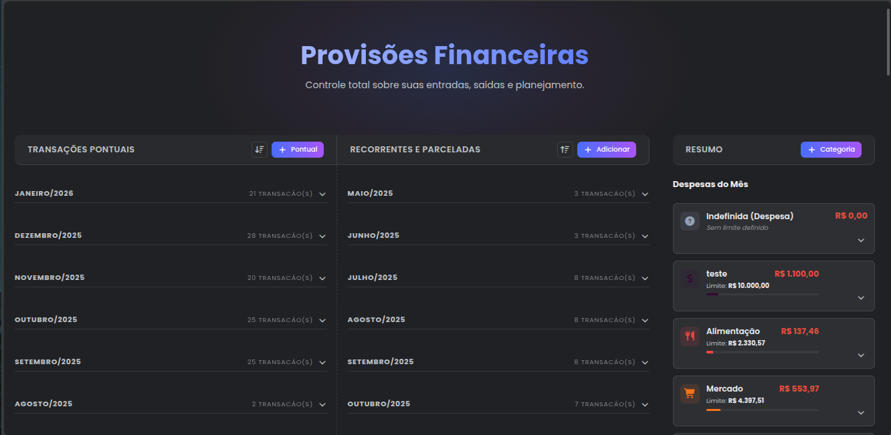
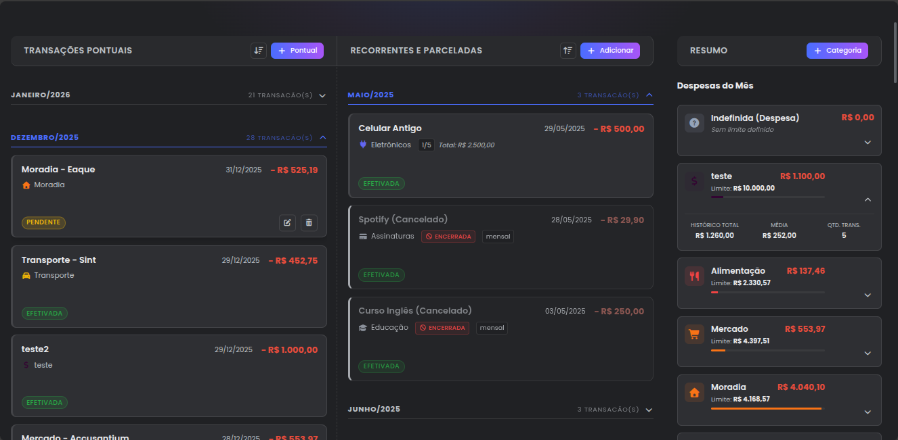

# 💰 Módulo Finanças

O módulo **Finanças** é o motor contábil do **Bússola V2**. Ele não apenas registra gastos, mas projeta o futuro financeiro do usuário através de um sistema inteligente de recorrências e parcelamentos.

> [!TIP]
> **Objetivo:** Oferecer controle total sobre o Fluxo de Caixa, permitindo visão de passado (histórico), presente (saldo atual) e futuro (contas a pagar/receber geradas automaticamente).

---

## 📂 Arquitetura e Arquivos

O módulo segue a arquitetura de **Camadas (Layered Architecture)** para separar responsabilidades:

| Camada | Arquivo | Responsabilidade |
| :--- | :--- | :--- |
| **Controller** | `app/api/endpoints/financas.py` | Recebe requisições HTTP, valida sessões e chama os serviços. |
| **Service** | `app/services/financas.py` | **Core da Lógica.** Contém regras de recorrência, parcelamento e projeção. |
| **Model** | `app/models/financas.py` | Definição das tabelas `transacao`, `categoria` e `historico_gasto_mensal`. |
| **Schema** | `app/schemas/financas.py` | DTOs (Data Transfer Objects) e validação de dados (Pydantic). |

---

## 🧠 Lógica de Negócio e Funcionalidades

### 1. Sistema de Transações Híbrido

O sistema suporta três tipos de movimentações financeiras, cada uma com um comportamento lógico distinto no banco de dados:

#### A. Transação Pontual
Um registro simples, único e imutável no tempo (ex: "Um café", "Gasolina").

#### B. Parcelamento Inteligente (Smart Installments)
Ao criar uma compra parcelada (ex: "Notebook em 10x"), o sistema não cria apenas um registro. Ele **projeta e insere todas as parcelas futuras** imediatamente.

> [!IMPORTANT]
> **Algoritmo de Centavos:** O sistema trata dízimas financeiras automaticamente. Se uma compra de R$ 100,00 for dividida em 3x, o sistema não divide simplesmente por 3 (o que daria 33.333...). Ele ajusta a diferença na **primeira parcela**.
> 
> Além disso, o sistema armazena o `valor_total_parcelamento` em cada registro, permitindo que o Frontend exiba "Total: R$ 100,00" de forma precisa, sem erros de soma de ponto flutuante.

```python
# Trecho de: app/services/financas.py -> criar_transacao

valor_parcela_base = round(valor_total / qtd_parcelas, 2)
diferenca = round(valor_total - (valor_parcela_base * qtd_parcelas), 2)

for i in range(1, qtd_parcelas + 1):
    valor_desta = valor_parcela_base
    
    # A diferença de arredondamento é somada à primeira parcela
    if i == 1:
        valor_desta += diferenca
    
    # ... O valor_total_parcelamento é salvo em cada linha para referência visual
```
*Resultado:* Parcela 1 = R$ 33,34 | Parcela 2 = R$ 33,33 | Parcela 3 = R$ 33,33. Total Visual = R$ 100,00.

#### C. Recorrência Infinita (Subscriptions)
Para contas fixas (Netflix, Aluguel, Salário), o sistema cria a primeira transação e marca com um `id_grupo_recorrencia`. O resto é gerenciado pelo **Worker de Projeção**.

---

### 2. Worker de Projeção Futura ("Horizonte de Previsão")

O Bússola V2 possui um mecanismo passivo que roda toda vez que o dashboard é carregado.

> [!NOTE]
> **Regra do Horizonte:** O sistema garante que existam transações criadas até **2 meses no futuro**. Isso evita a "cegueira financeira", permitindo que o usuário veja as contas que vencerão no início do próximo mês, mesmo que ainda esteja no dia 29 do mês atual.

```python
# Trecho de: app/services/financas.py -> gerar_transacoes_futuras

horizonte_limite = today + relativedelta(months=2)

# Loop de "Catch-up": Gera pendências até alcançar o horizonte de 2 meses
while proximo_vencimento.date() <= horizonte_limite:
    nova = Transacao(..., status='Pendente') 
    db.add(nova)
```

---

### 3. Gestão de Categorias e "Safe Delete"

O sistema impede a perda de dados financeiros acidental. As categorias possuem regras estritas de integridade.

* **Categoria "Indefinida":** Cada usuário possui, obrigatoriamente, uma categoria de sistema chamada "Indefinida" (uma para Receita, outra para Despesa).
* **Safe Delete:** Ao tentar excluir uma categoria personalizada (ex: "Lazer"), o sistema verifica se há transações nela. Se houver, elas **não são apagadas**, mas sim movidas para "Indefinida".

```python
# Trecho de: app/api/endpoints/financas.py -> delete_categoria

# Se houver órfãos, move para a categoria de sistema
if transacoes:
    cat_destino = financas_service.get_or_create_indefinida(db, cat.tipo, current_user.id)
    
    for t in transacoes:
        t.categoria_id = cat_destino.id # Re-parenting
    
    db.commit()

# Só agora a categoria original é excluída
db.delete(cat)
```

---

## 🎨 UX e Comportamento das Features

Para garantir consistência contábil e uma boa experiência, o sistema adota comportamentos específicos ao interagir com transações complexas.

### A. Encerrando Assinaturas e Parcelamentos
Quando o usuário clica em **Excluir** numa transação recorrente ou parcelada, o sistema entende que ele deseja **Interromper a série (Stop)**, e não apagar o passado.

1.  **Limpeza do Futuro:** Todas as transações futuras (Status: *Pendente*) são excluídas imediatamente para limpar a agenda.
2.  **Preservação do Passado:** As transações já realizadas (*Efetivadas*) ou vencidas são mantidas no banco.
3.  **Segurança ("Zumbi Logic"):** Uma flag `recorrencia_encerrada` é aplicada em **todo** o histórico restante do grupo. Isso impede que o *Worker de Projeção* encontre uma transação antiga "viva" e tente recriar a assinatura cancelada acidentalmente.

> [!CAUTION]
> **Feedback Visual:** Os cards de séries encerradas permanecem na lista para histórico, mas recebem uma **borda cinza** e uma etiqueta "Encerrada", indicando que não geram mais cobranças.

### B. Editando Valores (Cascata vs Unidade)
O sistema diferencia "Contratos Fixos" de "Assinaturas Variáveis" na hora da edição:

* 🔄 **Recorrentes (Ex: Netflix):** Se você editar o valor da mensalidade atual, a mudança é propagada **para todas as futuras**. Isso facilita reajustes de planos.
* 🔒 **Parceladas (Ex: TV em 10x):** A edição afeta **apenas a parcela atual**. O sistema entende que o parcelamento é um contrato fixo; se você adiantou uma parcela com desconto, isso não deve alterar o valor das seguintes.
* 🎯 **Pontuais:** A edição é isolada e afeta apenas o registro selecionado.

### C. Proteção de Dados
* **Imutabilidade de Tipo:** Por segurança, não é possível transformar uma transação "Recorrente" em "Pontual" via edição. Isso quebraria a lógica de agrupamento e projeção.
* **Fuso Horário Local:** O sistema armazena datas em UTC, mas exibe respeitando o fuso horário do navegador. Isso garante que uma conta que vence dia 05 não apareça como dia 04 devido a diferenças de horas.

---

## 📸 Prints do Design

Abaixo, uma visualização da interface do módulo financeiro em ação.

<div align="center">
  
  
</div>

---

## 📐 Estrutura de Dados (Models)

### `Transacao`
A unidade atômica financeira.
- **id_grupo_recorrencia** (Indexado): O elo que une parcelas ou recorrências.
- **valor_total_parcelamento**: Guarda o valor original da compra para exibição correta no histórico.
- **recorrencia_encerrada**: Flag de segurança que indica se a série foi cancelada.
- **status**: `Pendente` (padrão para futuras) ou `Efetivada`.
- **data**: Usa `datetime` com timezone UTC (convertido no front).

### `Categoria`
Agrupador lógico.
- **tipo**: `receita` ou `despesa`. Define se o valor soma ou subtrai no cálculo global.
- **user_id**: Garante isolamento total dos dados (Multi-tenancy).

---

## 🔌 API Endpoints

### Transações
| Método | Rota | Descrição |
| :--- | :--- | :--- |
| `POST` | `/transacoes` | Cria transação. Se parcelada, cria N registros e projeta valores. |
| `PUT` | `/transacoes/{id}` | Edita uma transação. Se recorrente, propaga para futuras. |
| `PATCH`| `/transacoes/{id}/encerrar-recorrencia` | Encerra uma série: apaga futuro, blinda passado. |
| `PUT` | `/transacoes/{id}/toggle-status` | Alterna entre Pendente/Efetivada (Quick Action). |
| `DELETE` | `/transacoes/{id}` | Deleta transação pontual permanentemente. |

### Categorias
| Método | Rota | Descrição |
| :--- | :--- | :--- |
| `POST` | `/categorias` | Cria categoria (valida unicidade de nome). |
| `PUT` | `/categorias/{id}` | Edita cor, ícone ou nome. |
| `DELETE` | `/categorias/{id}` | Deleta e move transações para "Indefinida". |

### Dashboard
| Método | Rota | Descrição |
| :--- | :--- | :--- |
| `GET` | `/` | Retorna JSON complexo com totais, listas agrupadas por mês e metadados. |