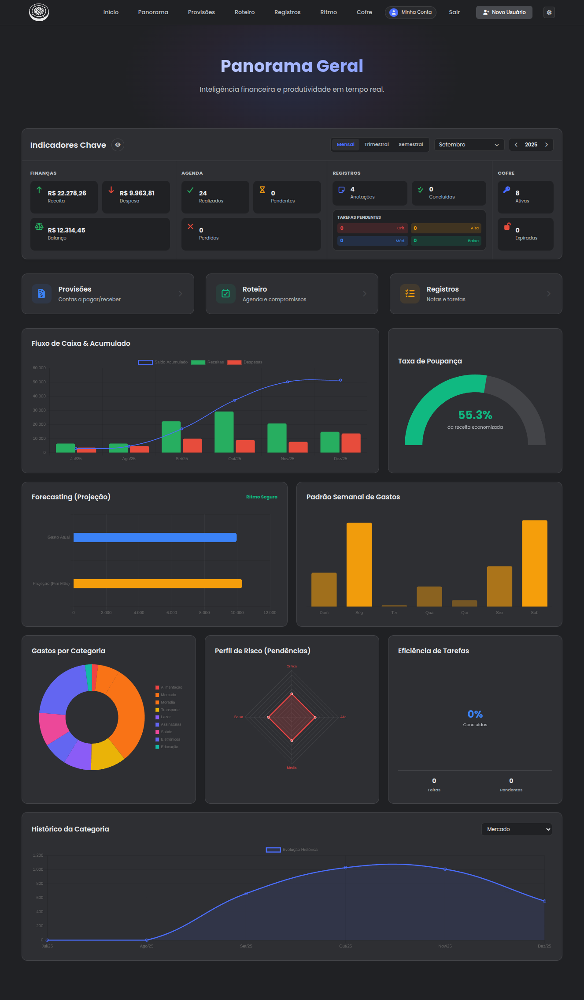

# 📊 Módulo Panorama (Dashboard & BI)

O módulo **Panorama** atua como a camada de **Inteligência de Negócios (BI)** do Bússola V2. Ele não possui banco de dados próprio; em vez disso, ele atua como um *Hub de Agregação*, consumindo dados de todos os outros módulos (Finanças, Agenda, Registros e Cofre) para gerar métricas consolidadas, gráficos de tendência e relatórios de saúde do sistema.

> [!TIP]
> **Objetivo:** Fornecer uma "Visão de Torre de Controle". O usuário deve ser capaz de entender sua situação financeira, pendências de agenda e produtividade em menos de 5 segundos após o login.

---

## 📂 Arquitetura e Arquivos

A arquitetura segue o padrão **Aggregation Service**. O Backend realiza o processamento pesado (somas, agrupamentos, projeções) e entrega JSONs formatados especificamente para consumo de bibliotecas de gráficos (Chart.js).

| Camada | Arquivo | Responsabilidade |
| :--- | :--- | :--- |
| **Controller** | `app/api/endpoints/panorama.py` | Exposição de rotas de leitura. Aceita parâmetros numéricos (`month`, `year`, `period_length`) para navegação temporal precisa. |
| **Service** | `app/services/panorama.py` | **Core Analytics.** Importa Models de todos os domínios, calcula agregações complexas (ex: agrupamento semanal real) e formata datasets. |
| **Schemas** | `app/schemas/panorama.py` | DTOs complexos aninhados (`PanoramaResponse`, `KpiData`, `ChartData`) para tipar a resposta massiva do dashboard. |
| **Frontend** | `src/pages/Panorama/index.jsx` | Renderização visual. Gerencia estado de filtros, "Modo Privacidade" e orquestra a abertura de modais de detalhe. |
| **Componentes**| `components/KpiCard.jsx` `components/PanoramaModals.jsx` | Componentes de UI reutilizáveis para exibição de métricas (com suporte a blur) e tabelas de *Drill-down*. |

---

## 🧠 Lógica de Negócio e Funcionalidades

### 1. Centralização e Agregação (Cross-Domain)
O serviço `PanoramaService` quebra os silos do sistema. Ele realiza *joins* e *queries* em múltiplas tabelas simultaneamente:
* **Finanças:** `Transacao`, `Categoria`.
* **Agenda:** `Compromisso`.
* **Produtividade:** `Tarefa`, `Anotacao`.
* **Segurança:** `Segredo`.

### 2. Filtros Temporais Avançados (Viagem no Tempo)
Diferente da versão anterior que usava filtros fixos ("Hoje"), o sistema agora permite navegação histórica completa.
* **Parâmetros:** O endpoint aceita `month`, `year` e `period_length` (1, 3, 6).
* **Dropdown Lógico:** O Frontend adapta a interface baseada na duração:
    * *Mensal:* Seleciona 1 mês específico (ex: "Fevereiro").
    * *Trimestral:* Seleciona trios sequenciais (ex: "Jan - Mar").
    * *Semestral:* Seleciona semestres (ex: "Jan - Jun").

### 3. Modo Privacidade (UX)
Para permitir o uso do dashboard em ambientes públicos (escritórios, cafés), foi implementado um **Modo de Privacidade**.
* **Toggle:** Um botão "Olho" na interface alterna o estado.
* **Comportamento:** Aplica um filtro CSS (`filter: blur`) e margens negativas em todos os valores monetários sensíveis.
* **Persistência:** A preferência do usuário é salva no `localStorage`, lembrando o estado entre sessões.

### 4. Estratégia de Carregamento (Lazy Loading / Drill-Down)
Para garantir que a Home carregue instantaneamente, o endpoint principal `GET /` retorna apenas números consolidados (KPIs) e dados para gráficos. As listas detalhadas (que podem ter milhares de registros) são separadas:

* **Visão Macro:** Carregada em `GET /`.
* **Visão Micro (Detalhes):**
    * `GET /provisoes`: Carrega apenas quando o usuário clica no card "Provisões".
    * `GET /roteiro`: Carrega a timeline completa ao clicar em "Roteiro".
    * `GET /registros`: Carrega tarefas e notas ao clicar em "Registros".

> [!NOTE]
> **Performance:** Essa estratégia evita trafegar megabytes de JSON desnecessariamente na renderização inicial da aplicação.

---

## 📊 Visualização de Dados (BI)

O Frontend utiliza `react-chartjs-2` para renderizar 5 tipos de visualizações estratégicas:

1.  **Fluxo de Caixa (Bar + Line):** Combina barras de Receita/Despesa com uma linha de Saldo Acumulado.
2.  **Padrão Semanal (Bar):** Agrega despesas reais por dia da semana (Dom-Sáb) para identificar dias de maior gasto.
3.  **Taxa de Poupança (Gauge/Donut):** Um velocímetro que mostra qual porcentagem da receita foi economizada.
4.  **Distribuição de Gastos (Donut):** Gráfico clássico de categorias.
5.  **Radar de Risco (Radar Chart):** Mapeia tarefas pendentes por prioridade.
6.  **Histórico de Categoria (Sparkline):** Gráfico de linha interativo que atualiza dinamicamente ao selecionar uma categoria.

---

## 📸 Estrutura de Dados (Schemas)

### `PanoramaResponse`
O payload mestre retornado ao frontend.

| Campo | Tipo | Descrição |
| :--- | :--- | :--- |
| `kpis` | `KpiData` | Objeto contendo 12 métricas escalares (Receita, Despesa, Pendências, etc). |
| `gastos_por_categoria` | `ChartData` | Labels e Arrays prontos para o gráfico de rosca. |
| `evolucao_mensal_*` | List[float] | Séries temporais para o gráfico de barras. |
| `gasto_semanal` | `ChartData` | Dados reais agregados por dia da semana. |
| `categorias_para_filtro` | List | Lista leve para popular o dropdown de filtro de histórico. |

---

## 📱 Screenshots (Interface de Inteligência)

### 1. Dashboard Principal (Visão da Torre de Controle)

*Visão unificada com o novo seletor de datas avançado, botão de privacidade e KPIs.*

### 2. Drill-down (Modais de Detalhe)

*Exemplo de "Drill-down": Ao clicar no card "Provisões", o sistema carrega uma tabela completa com filtros e ordenação sem sair da tela principal.*

---

## 🔌 API Endpoints

| Método | Rota | Descrição |
| :--- | :--- | :--- |
| `GET` | `/panorama/?month=X&year=Y&period_length=Z` | **Dashboard Mestre.** Retorna KPIs e gráficos filtrados pela data customizada. |
| `GET` | `/panorama/provisoes` | **Drill-down Financeiro.** Lista transações futuras e pendentes para o modal. |
| `GET` | `/panorama/roteiro` | **Drill-down Agenda.** Retorna timeline completa de compromissos. |
| `GET` | `/panorama/registros` | **Drill-down Produtividade.** Retorna mix de Tarefas e Anotações recentes. |
| `GET` | `/panorama/history/{cat_id}` | **Analytics On-Demand.** Retorna dados históricos específicos de uma categoria selecionada. |