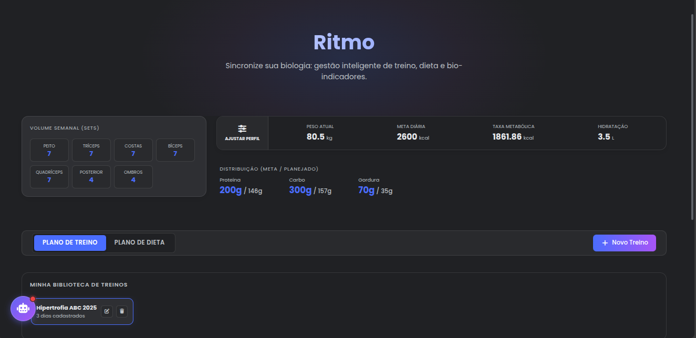
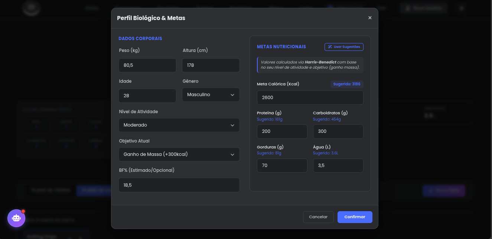
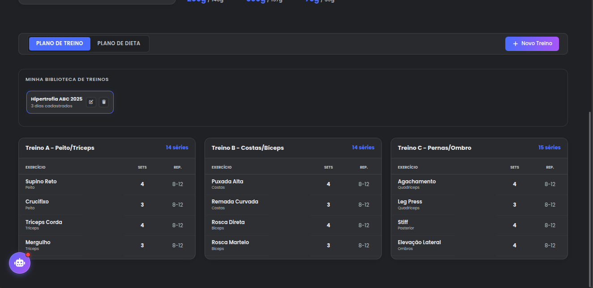
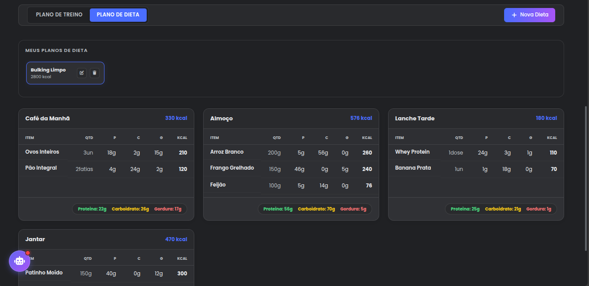

# ⚡ Módulo Ritmo (Saúde & Performance)

O módulo **Ritmo** é o núcleo de gestão de saúde física e metabólica do Bússola V2. Ele integra três domínios complexos: **Biometria (Corpo)**, **Treinamento (Cargas)** e **Nutrição (Dieta)**, permitindo que o sistema atue como um nutricionista e treinador digital.

> [!TIP]
> **Objetivo:** Calcular automaticamente o metabolismo basal (TMB), gerenciar a periodização de treinos e controlar a ingestão calórica com base em metas dinâmicas (Bulking/Cutting).

---

## 📂 Arquitetura e Arquivos

O módulo segue uma arquitetura hierárquica profunda, onde entidades "Pai" (como um Plano de Treino) controlam o ciclo de vida completo de seus filhos (Dias e Exercícios).

| Camada | Arquivo | Responsabilidade |
| :--- | :--- | :--- |
| **Controller** | `app/api/endpoints/ritmo.py` | Exposição de rotas RESTful. Divide-se em 3 blocos: `/bio`, `/treinos` e `/nutricao`. |
| **Service** | `app/services/ritmo.py` | **Core Logic.** Implementa fórmulas metabólicas (Harris-Benedict), gestão de estado "Ativo/Inativo" e lógica de **Reconciliação (Smart Diff)** para updates. |
| **Model** | `app/models/ritmo.py` | Mapeamento ORM complexo com relacionamentos `1:N` e `Cascade Delete` para garantir integridade referencial. |
| **Schema** | `app/schemas/ritmo.py` | DTOs aninhados com IDs opcionais para permitir a lógica de update inteligente. |
| **Frontend** | `src/pages/Ritmo/index.jsx` | UI Dashboard com abas (Treino/Dieta), Cards de Refeição e integração com modais inteligentes. |
| **Integração** | `app/data/taco.json` | Tabela TACO (Tabela Brasileira de Composição de Alimentos) local para busca rápida de calorias sem onerar o banco. |

---

## 🧠 Lógica de Negócio e Funcionalidades

### 1. Motor Metabólico (Auto-Cálculo & Customização)

O sistema possui um motor de cálculo nutricional híbrido: ele **sugere** valores científicos, mas permite **ajuste fino** pelo usuário.

**As Fórmulas (Sugestão Automática):**
1.  **Cálculo da TMB:** Utiliza a fórmula de **Harris-Benedict Revisada**, diferenciando por gênero.
2.  **Cálculo do GET (Gasto Energético Total):** Multiplica a TMB pelo Fator de Atividade (Sedentário a Atleta).
3.  **Ajuste de Objetivo:**
    * *Perda de Peso:* GET - 500kcal
    * *Ganho de Massa:* GET + 300kcal
4.  **Distribuição de Macros (Padrão):**
    * Proteína: 2.0g/kg
    * Gordura: 1.0g/kg
    * Carboidrato: Calorias restantes / 4
    * Água: 45ml/kg

**Override Manual (Liberdade):**
No modal de Bio, o usuário vê os valores sugeridos como "Tooltips" ou badges, mas tem total liberdade para digitar suas próprias metas (ex: dieta Cetogênica ou Low Carb), que sobrescrevem o cálculo automático.

### 2. Gestão de Planos (Viewer vs. Tracker)

O módulo atua principalmente como um **Planejador (Viewer)**.
* **Viewer:** Você constrói a "Ficha de Treino" e o "Cardápio Ideal". O sistema exibe isso de forma otimizada para consulta rápida durante o treino ou refeição.
* **Regra de Ativo:** Apenas um plano de treino e uma dieta podem estar vigentes por vez. Ao ativar um novo, o anterior é arquivado automaticamente.

### 3. Estratégia de Atualização Inteligente (Smart Diff)

Para resolver o problema de rotatividade de IDs e garantir histórico futuro, o sistema implementa uma lógica de **Reconciliação**:
* **Update:** Ao editar um plano, o backend compara os IDs recebidos com os do banco.
    * *Se o ID existe:* Atualiza os campos (preserva o registro).
    * *Se não tem ID:* Cria um novo registro.
    * *Se o ID sumiu:* Deleta o registro órfão.
* **Benefício:** Estabilidade referencial. Se você apenas corrigir o nome de um exercício, o ID dele permanece o mesmo.

---

## 📊 Estrutura de Dados (Models)

O módulo utiliza tabelas altamente normalizadas para permitir flexibilidade total.

### Domínio Treino
`RitmoPlanoTreino` (Cabeçalho) ➝ `RitmoDiaTreino` (Split A/B/C) ➝ `RitmoExercicioItem` (Séries/Reps).

### Domínio Nutrição
`RitmoDietaConfig` (Cabeçalho) ➝ `RitmoRefeicao` (Café/Almoço) ➝ `RitmoAlimentoItem` (Macros Calculados).

> [!NOTE]
> **Performance:** A tabela `RitmoDietaConfig` possui uma coluna `calorias_calculadas` que funciona como cache. O valor é atualizado sempre que uma refeição é editada (escrita), evitando que o sistema tenha que somar milhares de alimentos toda vez que listar as dietas (leitura).

---

## 📱 Screenshots (Interface)

### 1. Dashboard Principal (Visão Geral)

  
  
  
  

---

## 🔌 API Endpoints

| Método | Rota | Descrição |
| :--- | :--- | :--- |
| `GET` | `/ritmo/bio/latest` | **Snapshot.** Retorna bio atual + volume de treino semanal (Agregação). |
| `POST` | `/ritmo/bio` | Registra peso/medidas e metas (calculadas ou manuais). |
| `GET` | `/ritmo/treinos/ativo` | Retorna o plano de treino vigente para a Home/Panorama. |
| `POST` | `/ritmo/treinos` | Cria um plano completo. |
| `PUT` | `/ritmo/treinos/{id}` | Atualiza plano usando lógica de *Smart Diff*. |
| `PATCH`| `/ritmo/treinos/{id}/ativar` | Torna um plano o principal e desativa os outros. |
| `GET` | `/ritmo/local/foods?q=arroz` | Busca alimentos na base TACO (Offline/JSON). |