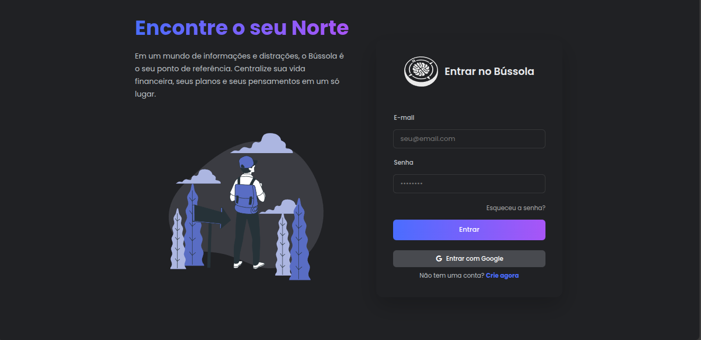
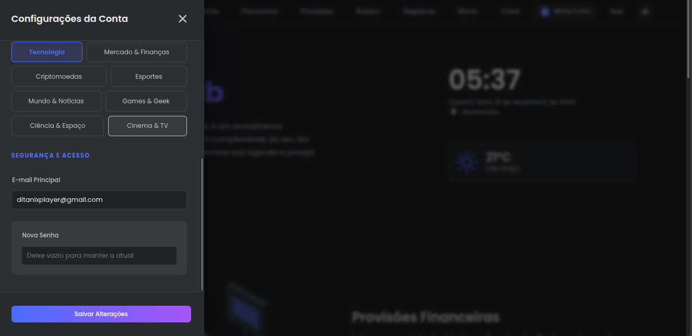

# 🛡️ Arquitetura de Segurança e Autenticação (Security Design)

Este documento detalha a infraestrutura de segurança do **Bússola V2**. O sistema adota uma abordagem de **Defesa em Profundidade**, implementando controles rigorosos desde a camada de banco de dados até a interface do usuário, garantindo a proteção de dados sensíveis e o gerenciamento robusto de identidades.

---

## 🔐 1. Modelos de Autenticação (AuthN)

O sistema implementa uma arquitetura de autenticação **Híbrida e Flexível**, suportando múltiplos provedores simultaneamente para o mesmo usuário.

### A. Autenticação Local (OAuth2 Password Flow)
* **Padrão:** Implementação estrita do `OAuth2PasswordBearer`.
* **Credenciais:** E-mail e Senha.
* **Armazenamento:** Senhas nunca são salvas em texto plano. Utilizamos **Bcrypt** (via `passlib`) com *salt* automático e *work factor* elevado para resistir a ataques de força bruta e rainbow tables.
* **Fluxo:** O frontend envia `FormData` (username/password) -> Backend valida hash -> Retorna um par de chaves: `access_token` e `refresh_token`.

### B. Autenticação Social (Google OAuth2 / OIDC)
* **Validação Server-Side:** O sistema não confia apenas no frontend. O token recebido do Google é revalidado no backend diretamente contra a API do Google (`googleapis.com/oauth2/v3/userinfo`) para garantir autenticidade.
* **Account Linking (Vínculo de Contas):**
    * Se um usuário fizer login com o Google usando um e-mail que já existe (criado via senha), o sistema realiza o **Account Linking** automático e seguro.
    * O campo `provider_id` é preenchido com o ID imutável do Google, blindando a conta contra falsificação de e-mail.

### C. Contas Híbridas
* Um usuário pode ter **ambos** os métodos ativos.
* **Cenário:** Usuário cria conta com Google. Depois, acessa o perfil e define uma senha local.
* **Resultado:** A conta passa a ter `auth_provider="hybrid"`, permitindo login tanto pelo botão Google quanto digitando senha.

---

## 🚀 2. Modos de Implantação e Ciclo de Vida

A segurança do Bússola V2 se adapta dinamicamente baseada na variável de ambiente `DEPLOYMENT_MODE`.

### Modo Self-Hosted (Uso Pessoal/Interno)
Focado em facilidade de instalação e "First-Time Setup".
1.  **Regra do "Primeiro Usuário" (First Owner Rule):** O sistema detecta se o banco de dados está vazio. O primeiro usuário a se cadastrar ganha automaticamente privilégios de **Superusuário (Admin)** e plano **Premium**. Os usuários subsequentes serão comuns.
2.  **Verificação Automática:** E-mails não precisam ser verificados manualmente para evitar a necessidade de configurar SMTP complexo em ambientes locais.
3.  **Recuperação Local:** Se o SMTP não estiver configurado, links de recuperação de senha são impressos no **Console/Terminal** do servidor para permitir o reset.

### Modo SaaS (Software as a Service)
Focado em segurança comercial e anti-spam.
1.  **Nenhum Admin Automático:** Todos os usuários nascem sem privilégios administrativos.
2.  **Verificação Obrigatória (Email Gate):**
    * O usuário é criado como `is_verified=False`.
    * Um token JWT de vida curta (24h) é enviado para o e-mail.
    * O login é **bloqueado** (retorna 401 Unauthorized) até que o token seja validado via rota `/verify-email`.
3.  **Exceção de Confiança (Google Login):**
    * **Lógica:** Se o usuário logar com o Google no modo SaaS, a verificação de e-mail é **pulada**.
    * **Motivo:** O Google atua como um "Provedor de Identidade Confiável". O sistema entende que, se você conseguiu logar na sua conta Google, o e-mail já é válido.

**Prova de Confiança no Código (`app/services/auth.py`):**
```python
# Dentro do método authenticate_google:
if not user:
    # CASO A: Novo Usuário via Google
    user = User(
        email=email,
        # ...
        is_verified=True,  # <--- JÁ NASCE VERIFICADO, MESMO EM SAAS
        # ...
    )
else:
    # CASO B: Usuário já existia (vínculo de conta)
    if not user.is_verified:
        user.is_verified = True # <--- ATUALIZA PARA VERIFICADO AUTOMATICAMENTE
```

---

## 🛡️ 3. Autorização e Controle de Acesso (AuthZ)

O sistema utiliza **RBAC (Role-Based Access Control)** simplificado.

| Role / Flag | Permissões |
| :--- | :--- |
| **User (Padrão)** | Acesso apenas aos seus próprios dados (`user_id` filtrado em todas as queries). Acesso negado a dados de terceiros. |
| **Verified** | Permissão para realizar Login (Crítico no modo SaaS). |
| **Premium** | Acesso a recursos avançados (SaaS). |
| **Superuser** | Acesso total a endpoints administrativos, criação de usuários manuais e gestão do sistema. |

### O Papel do Superuser (Admin)
É importante esclarecer que o usuário comum (não-superuser) **consegue usar a aplicação completamente**.

* **Quando o Superuser é necessário?** Apenas para gestão da infraestrutura da instância.
* **Exemplo Prático:** Se o `ENABLE_PUBLIC_REGISTRATION` estiver `False` (sistema fechado), ninguém consegue se cadastrar. Apenas um Superuser pode chamar a rota administrativa para criar contas manualmente para amigos ou funcionários.

**Prova de Autoridade no Código (`app/api/endpoints/users.py`):**
```python
@router.post("/", response_model=UserSchema)
def create_user_admin_manual(
    *,
    # Apenas quem tem a flag is_superuser=True passa por essa dependência
    current_user: User = Depends(deps.get_current_active_superuser), 
):
    """
    Permite que um Admin crie outros usuários manualmente,
    contornando as restrições de registro público fechado.
    """
    # ... criação do usuário ...
```

### Isolamento de Dados (Tenant Isolation)
A segurança dos dados é garantida no nível da aplicação. Todas as operações de banco de dados (CRUD) injetam o `current_user` na cláusula `WHERE`.
* *Exemplo:* `db.query(Transacao).filter(Transacao.user_id == current_user.id)`
* Isso torna matematicamente impossível que um usuário acesse o registro financeiro de outro, mesmo que ele tente manipular IDs na URL.

---

## 🔑 4. Gestão de Sessão, Tokens e Limites

O sistema evoluiu de um modelo puramente *stateless* para um modelo híbrido robusto, utilizando **Dual Tokens (Access + Refresh)** e **Redis** para segurança avançada.

### A. Arquitetura Dual Token (UX + Segurança)
Para equilibrar usabilidade (não deslogar toda hora) com segurança (token roubado expira rápido), utilizamos dois tokens:

1.  **Access Token:**
    * **Vida:** Curta (ex: 15 minutos).
    * **Uso:** Autoriza requisições na API.
    * **Expiração:** Quando expira, o frontend recebe `401 Unauthorized`.
2.  **Refresh Token:**
    * **Vida:** Longa (ex: 7 dias SaaS / 30 dias Self-Hosted).
    * **Uso:** Exclusivo para obter novos Access Tokens na rota `/auth/refresh`.
    * **Armazenamento:** `localStorage` (com rotação segura).

### B. Renovação Silenciosa (Frontend Interceptor)
O usuário nunca percebe que o token expirou. O **Interceptador Axios** (`api.ts`) captura o erro 401, pausa as requisições, usa o Refresh Token para renovar a sessão e refaz a chamada original automaticamente.

### C. Logout Seguro (Blacklist com Redis)
Ao clicar em "Sair", não basta limpar o navegador. O sistema invalida o token no servidor.
* **Fluxo:** O token é enviado para `/auth/logout`.
* **Redis:** O backend adiciona o token a uma **Blacklist** no Redis com um TTL igual ao tempo restante de vida do token.
* **Middleware:** Toda requisição checa se o token está no Redis. Se estiver, nega acesso (`401 Token Revoked`).

### D. Rate Limiting (Proteção Brute-Force)
Para evitar ataques de força bruta em senhas ou inundação de requisições, utilizamos o **SlowAPI** com backend no Redis. A política é dinâmica baseada no modo de deploy:

**Lógica Adaptativa (`app/core/config.py`):**
```python
@property
def RATE_LIMIT_STRATEGY(self) -> str:
    # SaaS: Proteção agressiva contra bots da internet
    if self.DEPLOYMENT_MODE == "SAAS":
        return "5/minute"
    # Self-Hosted: Relaxado para não travar o dono do servidor local
    return "100/minute"
```

---

## 🔒 5. Proteção de Ações Sensíveis (Sudaproof)

Para evitar sequestro de conta (Session Hijacking ou acesso físico indevido), o sistema implementa barreiras adicionais:

### Mudança de E-mail ou Senha
Se um usuário autenticado tentar alterar seu e-mail ou senha via endpoint `/users/me`:
1.  O sistema exige o envio do campo `current_password`.
2.  O backend valida se a senha atual confere antes de processar a mudança.
3.  *Exceção:* Usuários puramente Google (sem senha local) podem definir uma senha pela primeira vez sem essa verificação.

### Força de Senha (UX Preventiva)
No Frontend (Registro e Reset), utilizamos a biblioteca **zxcvbn** (padrão de segurança do Dropbox) para calcular a entropia da senha em tempo real.
* **Barra Visual:** Exibe cores (Vermelho -> Verde) indicando a força.
* **Bloqueio:** O sistema impede o envio de senhas com score baixo (< 2), educando o usuário a não usar "123456".

### Proteção de Dados (GDPR/LGPD)
O modelo de dados implementa `cascade="all, delete-orphan"` em todos os relacionamentos do Usuário.
* **Direito ao Esquecimento:** Se um usuário for deletado, o banco de dados apaga **instantaneamente e em cascata** todos os seus registros (Finanças, Agenda, Cofre, Ritmo, etc.), não deixando rastros órfãos.

---

## 📧 6. Fluxos de E-mail e Recuperação

O sistema de mensageria é utilizado para validação de identidade e é processado de forma assíncrona.

### Processamento Assíncrono (Background Tasks)
O envio de e-mails (Registro e Reset) utiliza `BackgroundTasks` do FastAPI.
* **Benefício:** A API retorna a resposta "Usuário criado" ou "Email enviado" instantaneamente, sem travar a interface enquanto conecta ao servidor SMTP.

### Esqueci Minha Senha
1.  Backend gera um token JWT específico com validade curta (15 minutos).
2.  Envia link único por e-mail.
3.  O token é invalidado após o uso ou expiração.

---

## 🧹 7. Rotinas de Manutenção e Anti-Squatting

Para manter a higiene do banco de dados e evitar o sequestro de e-mails (Email Squatting), o sistema implementa scripts de manutenção.

### Limpeza de Contas "Zumbis"
Em ambientes SaaS, usuários podem se cadastrar com e-mails errados ou de terceiros e nunca verificar a conta. Isso bloquearia o e-mail legítimo para sempre.

* **Solução:** Script `scripts/cleanup_users.py`.
* **Regra:** Apaga usuários que atendem a `is_verified=False` **E** `created_at > 24 horas`.
* **Automação:** Deve ser executado via Cron Job ou Celery Beat diariamente.

---

## 🚦 8. Referência de Erros de Segurança

O sistema utiliza códigos HTTP padrão para comunicar estados de segurança específicos:

| Código | Significado | Cenário no Bússola V2 |
| :--- | :--- | :--- |
| **400** | Bad Request | Dados inválidos, E-mail já existe, Senha atual incorreta. |
| **401** | Unauthorized | Token Expirado, Token Revogado (Logout), E-mail não verificado. |
| **403** | Forbidden | Token Inválido (Assinatura ruim), Tentativa de acesso a recurso admin. |
| **404** | Not Found | Usuário não encontrado (usado para evitar enumeração em alguns casos). |
| **429** | Too Many Requests | Rate Limit excedido (Muitas tentativas de login/registro). |

---

## 📱 Screenshots (Interfaces de Segurança)

### 1. Tela de Login & Registro

*Interface unificada suportando login por e-mail/senha e OAuth Social (Google). Exibe alertas visuais caso o e-mail não tenha sido verificado.*

### 2. Gestão de Conta (User Drawer)

*Painel lateral onde o usuário gerencia dados sensíveis. Note a barra de força de senha (zxcvbn) e a exigência de senha atual para alterações críticas.*

---

## 🧩 9. Resumo da Stack de Segurança

| Componente | Tecnologia / Biblioteca | Função |
| :--- | :--- | :--- |
| **Tokenização** | `python-jose` | Geração e validação de JWT (Access + Refresh). |
| **Cache/Blacklist** | `Redis` | Armazenamento de tokens revogados e contagem de Rate Limit. |
| **Rate Limit** | `SlowAPI` | Proteção contra DDoS e Brute-force em endpoints críticos. |
| **Hashing** | `passlib[bcrypt]` | Criptografia irreversível de senhas. |
| **Validação Senha** | `zxcvbn` (Front) | Análise de entropia e feedback visual de força de senha. |
| **Validação Dados** | `pydantic` | Sanitização rigorosa de entradas (Schemas) para prevenir Injection. |
| **Background Tasks** | `Starlette BackgroundTasks` | Envio de e-mails sem bloquear a requisição HTTP. |
| **CORS** | `fastapi.middleware.cors` | Proteção contra execução de scripts de origens não autorizadas. |
| **Google Auth** | `google-auth` / `httpx` | Validação server-side de tokens OIDC. |

---

> [!CAUTION]
> **Nota para Administradores:** A variável `SECRET_KEY` no arquivo `.env` é a chave mestra da criptografia. Se ela for vazada, todos os tokens podem ser falsificados. Nunca comite este arquivo em repositórios públicos.